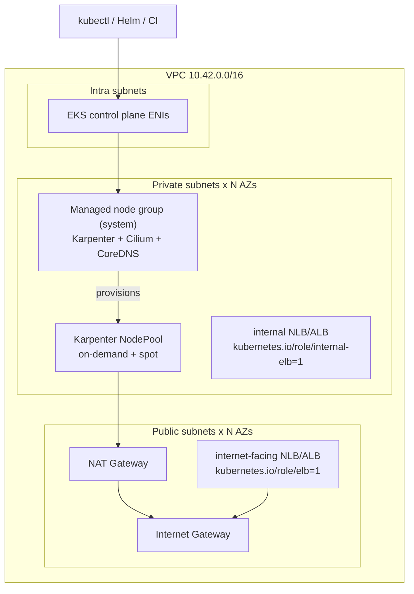
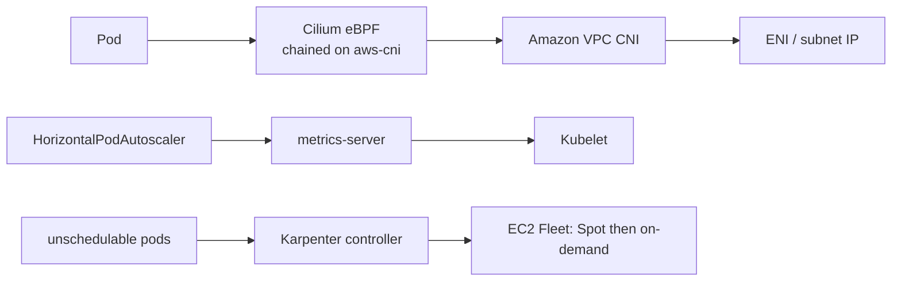

# Production EKS reference (Terraform)

A multi-AZ Amazon EKS cluster with a small **system** managed node group, [Karpenter](https://karpenter.sh/) for workload nodes (on-demand + Spot, consolidation on), [Cilium](https://cilium.io/) chained onto the VPC CNI, and metrics-server. This is the cloud-shaped counterpart to `clusters/kind` and `clusters/k3s`; the regulated payment platform lives in `scenarios/fintech-payments`.

Pinned to **Terraform 1.5+**, **AWS provider 5.x** (`~> 5.95`), [terraform-aws-modules/eks/aws `~> 20.37`](https://registry.terraform.io/modules/terraform-aws-modules/eks/aws/20.37.1) (last 20.x line that stays on AWS provider 5; 21.x requires AWS provider 6), and [terraform-aws-modules/vpc/aws `~> 5.21`](https://registry.terraform.io/modules/terraform-aws-modules/vpc/aws/5.21.0).

Kubernetes **1.34** is the default: in standard support on EKS until 2026-12-02 ([version calendar](https://docs.aws.amazon.com/eks/latest/userguide/kubernetes-versions.html)). Karpenter **1.14.1** (LTS, 2026-08-21) supports Kubernetes 1.29–1.36 ([compatibility](https://endoflife.date/karpenter)).

## When to use / when NOT to use

**Use this** as a starting point for a real AWS account: private nodes, IRSA + Pod Identity, Karpenter instead of Cluster Autoscaler, Cilium NetworkPolicy, multi-AZ NAT (optional). Copy the modules, lock the public API CIDR, pin AMIs, and add your GitOps chart.

**Do not use this** as a cheap laptop cluster (use kind/k3s), or as a drop-in for PCI-scoped payments (use `scenarios/fintech-payments`, which adds Gatekeeper, Tetragon, Velero, and Argo CD). Applying this in a commercial account **costs money** (EKS control plane, NAT, two `m6i.large` / `m5.large` nodes) until you `terraform destroy`.

### Trade-offs

| Choice | Why | Cost |
| --- | --- | --- |
| terraform-aws-eks **v20.37** + AWS provider **5.x** | Matches the requested 5.x constraint; v21 needs AWS provider ≥ 6.59 | Misses v21 extras (Auto Mode knobs, `name` vs `cluster_name` rename) |
| VPC CNI **+ Cilium chaining** | Node group becomes Ready in one apply; Cilium still gives eBPF NetworkPolicy / Hubble | Not a full kube-proxy/ENI replacement. Migrate to `eni.enabled=true` later if you want Cilium as the only CNI |
| Karpenter NodePool + EC2NodeClass (v1) | Current CRDs. `Provisioner` / `AWSNodeTemplate` were renamed in Karpenter 1.0 | Must install `karpenter-crd` chart alongside the controller |
| System MNG + Karpenter for the rest | Karpenter cannot scale from zero without somewhere to run; the MNG is that island | Two always-on nodes |
| `single_nat_gateway = true` default | Labs do not need three NAT gateways | AZ outage of that NAT blacks out private egress. Set `false` in production |
| Public API endpoint | Lets your laptop run Helm/kubectl without a bastion | Lock `cluster_endpoint_public_access_cidrs` to your IP/VPN |

### Gotchas

- **Destroy order.** Karpenter-created EC2 instances are *not* in Terraform state. Drain/delete the NodePool (or `kubectl delete nodepool --all`) and wait for nodes to terminate **before** `terraform destroy`, or destroy will hang on ENIs/SGs.
- **Discovery tags.** Exactly one node security group and the private subnets must carry `karpenter.sh/discovery = <cluster_name>`. Duplicate tags in the account make Karpenter attach the wrong SG.
- **AMI alias `al2023@latest`.** Convenient for a lab; Karpenter will drift-replace nodes when a new EKS-optimized AMI ships. Pin (`al2023@vYYYYMMDD`) in production ([managing AMIs](https://karpenter.sh/docs/concepts/nodeclasses/#specamiselectorterms)).
- **Helm provider.** `terraform apply` talks to the live API with `aws eks get-token`. You need network access to the API endpoint (public, or from inside the VPC).
- **IRSA hop limit.** EC2NodeClass sets `httpPutResponseHopLimit: 2` so pods can reach IMDSv2. Hop limit 1 breaks IRSA.

## Architecture





## Prerequisites

| Tool | Version | Notes |
| --- | --- | --- |
| Terraform | 1.5.7+ | `terraform version` |
| AWS CLI v2 | current | `aws sts get-caller-identity` must succeed |
| IAM principal | — | Rights to EKS, EC2, IAM, VPC, SQS, EventBridge, CloudWatch Logs, KMS, Helm-installed add-ons |
| kubectl | 1.30+ | For verify / teardown of NodePools |
| Helm | 3.14+ | Only needed for manual debugging; Terraform drives `helm_release` |

AWS credentials come from the usual chain (`AWS_PROFILE`, env vars, instance role). **Do not** put keys in `terraform.tfvars`.

Service-linked roles `AWSServiceRoleForAmazonEKS` and `AWSServiceRoleForEC2Spot` must exist (or your principal must be allowed to create them). Spot:

```bash
aws iam create-service-linked-role --aws-service-name spot.amazonaws.com
```

(safe to ignore `InvalidInput` if it already exists).

## Deploy

```bash
cd clusters/eks
cp terraform.tfvars.example terraform.tfvars
# edit region, cluster_name, and cluster_endpoint_public_access_cidrs

terraform init
terraform fmt -check
terraform validate
terraform plan -out=tfplan
terraform apply tfplan
```

First apply takes 15–25 minutes (control plane, node group, Helm). Then:

```bash
aws eks update-kubeconfig --region us-west-2 --name k8s-arch-eks
kubectl get nodes -L karpenter.sh/registered,karpenter.sh/capacity-type
kubectl get nodepool,ec2nodeclass
kubectl -n kube-system get deploy cilium-operator metrics-server karpenter
kubectl -n kube-system get ds cilium aws-node
```

Expected: two `Ready` system nodes (no `karpenter.sh/registered` label), Cilium + aws-node DaemonSets, Karpenter Deployment 2/2 once the controller rolls, `NodePool/default` and `EC2NodeClass/default` present.

Inflate a workload and watch Karpenter launch a Spot (or on-demand) node:

```bash
kubectl create deployment inflate --image=public.ecr.aws/eks-distro/kubernetes/pause:3.10 --replicas=10
kubectl scale deployment inflate --replicas=0   # consolidation should reclaim the node
kubectl delete deployment inflate
```

## Teardown

```bash
kubectl delete nodepool --all --wait=true
kubectl delete ec2nodeclass --all --wait=true
# wait until only the system MNG nodes remain
kubectl get nodes -L karpenter.sh/registered

terraform destroy
```

If destroy still sticks on ENIs, delete leftover Karpenter instances in EC2 tagged `karpenter.sh/discovery=<cluster_name>` and retry.

## What Terraform creates

| File | Contents |
| --- | --- |
| `vpc.tf` | VPC, 2–3 AZs, public + private + intra subnets, NAT, EKS/Karpenter tags |
| `eks.tf` | EKS 1.34, IRSA OIDC, system MNG, vpc-cni/kube-proxy/coredns/pod-identity add-ons, `module.addons` |
| `karpenter.tf` | Controller IAM (Pod Identity + IRSA), node IAM role, SQS interruption queue, Helm charts `karpenter-crd` + `karpenter` + NodePool/EC2NodeClass |
| `addons/` | `helm_release` for Cilium 1.20.1 and metrics-server 3.13.0 |

Karpenter CRD names in this repo are the **v1** names (`NodePool`, `EC2NodeClass`), not the retired `Provisioner` / `AWSNodeTemplate`.

## Manual steps before `terraform apply`

1. Copy `terraform.tfvars.example` → `terraform.tfvars` and set `region` / `cluster_name`.
2. Restrict `cluster_endpoint_public_access_cidrs` to your IP or VPN (`0.0.0.0/0` is a lab default only).
3. Export working AWS credentials (`AWS_PROFILE` or `AWS_ACCESS_KEY_ID` / `AWS_SECRET_ACCESS_KEY` / `AWS_SESSION_TOKEN`). Confirm with `aws sts get-caller-identity`.
4. Ensure the EC2 Spot service-linked role exists (command above).
5. Optional production knobs in `terraform.tfvars`: `single_nat_gateway = false`, pin `karpenter_version` / AMI alias, raise `system_node_*` sizes.
6. `terraform init` (downloads AWS + Helm providers and the EKS/VPC modules).
