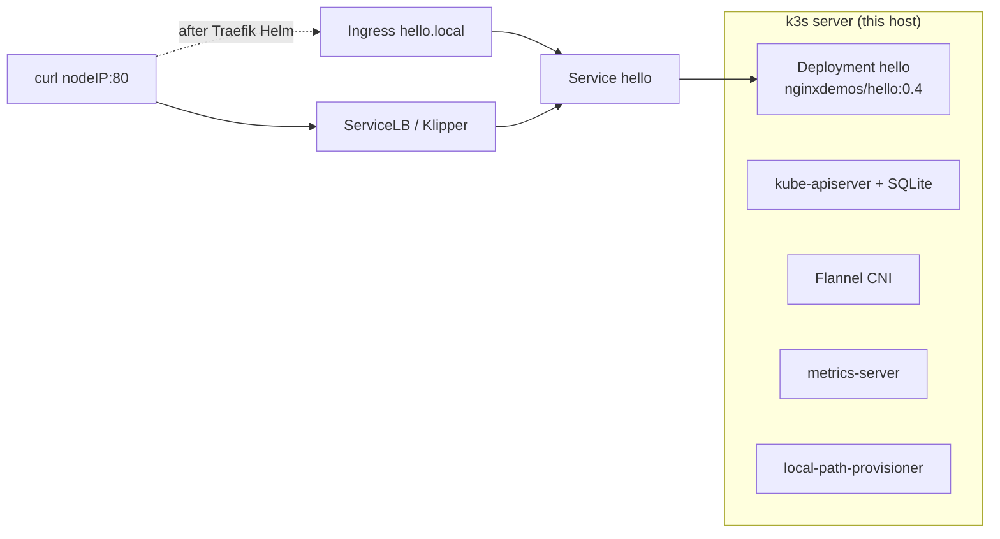

# k3s playground (edge / single-node)

A single-node [k3s](https://docs.k3s.io/) cluster for a Linux host, VM, or edge box. k3s is a CNCF-graduated, fully conformant Kubernetes distribution that packages containerd, Flannel, CoreDNS, metrics-server, and a local-path provisioner into one binary (~100 MB) and one systemd unit.

This reference **disables the bundled Traefik** (`--disable traefik`) so north-south traffic is not magically handled for you. You install an Ingress controller of your choice, then apply a normal `Ingress`. Until you do, the example app is still reachable through k3s's [ServiceLB (Klipper)](https://docs.k3s.io/networking/networking-services#service-load-balancer) on a `LoadBalancer` Service.

The installer is the upstream script at [https://get.k3s.io](https://get.k3s.io). Flags and env vars match the [configuration](https://docs.k3s.io/installation/configuration) and [server CLI](https://docs.k3s.io/cli/server) docs (checked 2026-09). The `stable` channel currently tracks Kubernetes **1.35.x** (for example [v1.35.7+k3s1](https://github.com/k3s-io/k3s/releases)).

## When to use / when NOT to use

**Use k3s** when you want Kubernetes on a resource-constrained host: edge/IoT gateways, retail/factory kiosks, a homelab box, CI runners, or a single-node "appliance" cluster. It starts in seconds, runs on 512 MB RAM class devices (1 GB+ is comfortable), and supports [multi-server HA with embedded etcd](https://docs.k3s.io/datastore/ha-embedded) later if the site grows.

**Do not use k3s** as a stand-in for a multi-AZ managed control plane. There is no Karpenter, no AWS/GCP cloud controller unless you add one, and a single-node install is a single failure domain. For a laptop playground with three kubeadm-shaped nodes see `clusters/kind`. For a production payment platform see `clusters/eks` and `scenarios/fintech-payments`.

### Trade-offs

| Choice | Why | Cost |
| --- | --- | --- |
| k3s, not k0s/MicroK8s | Smallest operational surface; one install script; CNCF graduated | Opinionated defaults (Flannel, SQLite, local-path) |
| `--disable traefik` | Shows a real `Ingress` object you own, instead of the hidden bundled chart | You must install a controller or use ServiceLB |
| ServiceLB left **on** | `type: LoadBalancer` works on a bare metal / edge box without MetalLB | Binds host ports; not a cloud NLB |
| SQLite (default) | Zero extra datastore on a single node | Not HA; switch to etcd (`--cluster-init`) for 3-server |
| Flannel VXLAN | Works on almost any NIC / overlay | Not eBPF; use [Cilium on k3s](https://docs.k3s.io/networking/multus-cilium) if you need NetworkPolicy at scale |

### Gotchas

- The kubeconfig is owned by root at `/etc/rancher/k3s/k3s.yaml`. This install sets `--write-kubeconfig-mode 644` ([docs](https://docs.k3s.io/cli/server)) so other users can read it. Restrict the host if that is too open.
- `--disable traefik` **uninstalls** Traefik if you re-run the script on a node that already had it ([packaged components](https://docs.k3s.io/installation/packaged-components)).
- `kubectl` from the distro is **not** required: k3s ships `/usr/local/bin/kubectl` as a symlink. If you already have kubectl, `export KUBECONFIG=/etc/rancher/k3s/k3s.yaml`.
- Swap: recent k3s/kubelet tolerate swap, but edge images sometimes still need `swapoff -a`.
- Air-gapped: do **not** use this script; follow the [airgap install](https://docs.k3s.io/installation/airgap).

## Prerequisites

| Tool | Notes |
| --- | --- |
| Linux host | systemd or openrc. x86_64 or aarch64. Root or sudo. |
| curl | Used to fetch `https://get.k3s.io`. |
| Ports | 6443 (API) free. 80/443 free if you later install an Ingress controller that binds host ports. |
| kubectl (optional) | k3s installs one. 1.30+ is fine. |

Docker is **not** required. k3s uses its own containerd.

## Install

```bash
cd clusters/k3s
chmod +x install.sh
./install.sh
```

The script is idempotent (`set -euo pipefail`): it re-runs the official installer (the supported way to update flags), enables the systemd unit, waits for the node to be `Ready`, and applies `manifests/`.

Pin a version or channel if you need to:

```bash
INSTALL_K3S_CHANNEL=stable ./install.sh
INSTALL_K3S_VERSION=v1.35.7+k3s1 ./install.sh
```

Equivalent one-liner (same flags, no manifests):

```bash
curl -sfL https://get.k3s.io | INSTALL_K3S_EXEC="server --disable traefik --write-kubeconfig-mode 644" sh -
```

## Verify

```bash
export KUBECONFIG=/etc/rancher/k3s/k3s.yaml
kubectl get nodes
kubectl get pods -A
kubectl get deploy,svc,ingress -n edge
```

Expected: one `Ready` node, CoreDNS + metrics-server + local-path-provisioner running, **no** Traefik pods, and the `hello` Deployment/Service/Ingress in namespace `edge`.

Hit the app through ServiceLB (Klipper publishes the node IP):

```bash
NODE_IP="$(kubectl get nodes -o jsonpath='{.items[0].status.addresses[?(@.type=="InternalIP")].address}')"
kubectl get svc -n edge hello
curl -sS "http://${NODE_IP}/"
```

### Optional: install an Ingress controller so the Ingress object actually routes

ingress-nginx [retired in March 2026](https://kubernetes.io/blog/2025/11/11/ingress-nginx-retirement/) and must not be used for new work. On k3s the usual choice is to put Traefik back **on your terms** (Helm), or to use Gateway API.

Traefik via Helm (requires [Helm 3](https://helm.sh/docs/intro/install/)):

```bash
export KUBECONFIG=/etc/rancher/k3s/k3s.yaml
helm repo add traefik https://traefik.github.io/charts
helm repo update
helm upgrade --install traefik traefik/traefik \
  --namespace kube-system \
  --set ingressClass.enabled=true \
  --set ingressClass.isDefaultClass=true
kubectl wait --for=condition=Available deploy/traefik -n kube-system --timeout=120s
curl -sS -H "Host: hello.local" "http://${NODE_IP}/"
```

The example Ingress uses `ingressClassName: traefik` and host `hello.local`.

## Uninstall

The installer writes `/usr/local/bin/k3s-uninstall.sh`. That script stops k3s, deletes the SQLite datastore, local-path volumes, and the kubeconfig. It does **not** touch external datastores or cloud PVs. See [Uninstalling K3s](https://docs.k3s.io/installation/uninstall).

```bash
sudo /usr/local/bin/k3s-uninstall.sh
```

## What gets installed



1. **k3s server** — single node, `stable` channel, Traefik disabled, kubeconfig mode 644.
2. **Example app** — `manifests/hello.yaml` (Namespace + Deployment + Service + Ingress). See [manifests/README.md](manifests/README.md) for why this shape fits edge/IoT.

## Next steps

- HA at a site: three servers with `--cluster-init` / `K3S_URL` ([embedded etcd](https://docs.k3s.io/datastore/ha-embedded)).
- Replace Flannel with Cilium: [k3s networking](https://docs.k3s.io/networking/multus-cilium).
- Join an edge fleet to a production cluster: see Cilium Cluster Mesh in `docs/architecture/multi-cluster-and-resilience.md`.
