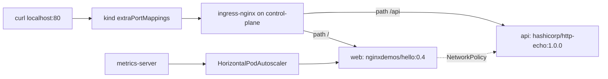

# kind playground

A three-node local Kubernetes cluster you can bring up with Docker, [kind](https://kind.sigs.k8s.io/), kubectl, and Helm. It is the laptop-sized entry point for this repo: enough real API objects to poke at, not a copy of the production stack in `scenarios/fintech-payments/`.

## When to use / when not

**Use this** to learn current Kubernetes objects (Ingress, HPA, NetworkPolicy), to try Helm vs plain manifests, or to validate YAML before promoting it.

**Do not use this** as a production topology. kind nodes are Docker containers; there is no multi-AZ control plane, no Karpenter, and the default CNI ([kindnet](https://kind.sigs.k8s.io/docs/user/quick-start/)) is not Cilium. For a regulated, multi-AZ design see `scenarios/fintech-payments/`. For why production north-south traffic should be Gateway API rather than ingress-nginx, see [docs/architecture/networking.md](../../docs/architecture/networking.md).

### Trade-offs

| Choice | Why | Cost |
| --- | --- | --- |
| kind (not minikube/k3d) | Multi-node, kubeadm-shaped, matches CI usage | Needs Docker; heavier than k3s |
| ingress-nginx | Still the most copy-pasteable Ingress controller for kind | [Retired March 2026](https://kubernetes.io/blog/2025/11/11/ingress-nginx-retirement/) — no further security patches. Artifacts remain; use Gateway API in production |
| extraPortMappings :80/:443 | `curl localhost` works without cloud-provider-kind | Binds privileged host ports; controller must land on the control-plane node |
| metrics-server + `--kubelet-insecure-tls` | Makes HPA actually observe CPU | Insecure TLS is **dev-only**; never copy that flag to production |

## Prerequisites

| Tool | Version | Install |
| --- | --- | --- |
| Docker | 24+ with a running daemon | [docs.docker.com](https://docs.docker.com/get-docker/) |
| kind | v0.33.0+ (defaults to Kubernetes 1.37) | [kind quick start](https://kind.sigs.k8s.io/docs/user/quick-start/#installation) |
| kubectl | 1.30+ | [kubernetes.io](https://kubernetes.io/docs/tasks/tools/) |
| Helm | 3.14+ | [helm.sh](https://helm.sh/docs/intro/install/) |

Host ports **80** and **443** must be free. First `./up.sh` pulls the `kindest/node:v1.37.0` image (~1 GB) plus workload images.

## Commands (zero to a working cluster)

```bash
cd clusters/kind
chmod +x up.sh down.sh
./up.sh
```

`up.sh` is idempotent: it creates the cluster only if `playground` is absent, then (re)installs add-ons and the example app.

Verify:

```bash
kubectl get nodes
kubectl get pods -n demo
kubectl get ingress -n demo
curl -sS http://localhost/
curl -sS http://localhost/api
```

Expected: three `Ready` nodes (`playground-control-plane`, `playground-worker`, `playground-worker2`), demo pods `Running`, and HTML / plain-text responses from the two curl commands.

Tear down:

```bash
./down.sh
```

Kubeconfig is written to `$KUBECONFIG` or `~/.kube/config`. Context name: `kind-playground`. Re-export with `kind export kubeconfig --name playground`.

## What gets installed



1. **kind cluster `playground`** — 1 control-plane + 2 workers, Kubernetes 1.37.0 node image from [kind v0.33.0](https://github.com/kubernetes-sigs/kind/releases/tag/v0.33.0). Control-plane is labelled `ingress-ready=true` and maps host 80/443.
2. **ingress-nginx** — Helm chart `ingress-nginx` version `4.15.1` from [https://kubernetes.github.io/ingress-nginx](https://kubernetes.github.io/ingress-nginx) (controller [v1.15.1](https://kubernetes.github.io/ingress-nginx/deploy/), last stable line). `hostPort` enabled and nodeSelector `ingress-ready=true` so traffic from `extraPortMappings` actually hits the controller. The project's own matrix last lists Kubernetes 1.31–1.35; Ingress `networking.k8s.io/v1` is stable, so this still runs on kind's 1.37 node image.
3. **metrics-server** — Helm chart `3.14.0` ([app v0.9.0](https://kubernetes-sigs.github.io/metrics-server/)) in `kube-system`, with `--kubelet-insecure-tls` because kind kubelets present self-signed serving certs.
4. **example-app** (plain manifests in `example-app/`):
   - Namespaces `demo` and `monitoring`
   - Deployment + Service `web` (`nginxdemos/hello:0.4`, port 80)
   - Deployment + Service `api` (`hashicorp/http-echo:1.0.0`, port 8080)
   - Ingress (`networking.k8s.io/v1`) routing `/api` → api, `/` → web
   - HorizontalPodAutoscaler (`autoscaling/v2`) on `web`
   - NetworkPolicy default-deny plus allowlists (ingress-nginx, web→api, DNS)
   - ConfigMap `demo-config` and Secret `demo-secrets` (example values, not real credentials)

The `monitoring` namespace is reserved for optional add-ons (Prometheus / Grafana / Loki). This playground does not install them; `up.sh` only creates the namespace and a marker ConfigMap.

## Helm alternative (same demo app)

`./up.sh` applies **plain manifests**. To install the same workload as a chart instead (do **not** run both against the same names):

```bash
# Fresh cluster + ingress only: comment out the kubectl apply lines in up.sh,
# or delete the demo namespace first:
kubectl delete namespace demo --ignore-not-found

helm upgrade --install demo ./charts/demo-app \
  --namespace demo \
  --create-namespace \
  --wait
```

Then `helm lint ./charts/demo-app` should be clean.

## Example values you must change outside this playground

These are **concrete, working** values so the cluster comes up. They are not secrets worth protecting, and they must not ship to a shared cluster as-is:

| Object | Key | Playground value |
| --- | --- | --- |
| Secret `demo-secrets` | `api-token` | `demo-not-for-production-token` |
| Secret `demo-secrets` | `demo-password` | `demo-pass-change-me` |
| Ingress | `host` | `localhost` (change to a real hostname + DNS) |

## Gotchas

- **Ports 80/443 in use.** Stop the other listener or change `hostPort` in `kind-config.yaml` (then curl that port instead).
- **ingress-nginx on the wrong node.** If you drop the `ingress-ready` label or the Helm `nodeSelector`, the controller can land on a worker and `curl localhost` hangs. This is the classic multi-node kind footgun.
- **NetworkPolicy on kindnet.** Policies are valid API objects and *may* be enforced depending on kindnet version; they are not a substitute for Cilium. Treat them as the shape you would apply in production.
- **HPA metrics stay `<unknown>` for ~30s** after metrics-server starts. That is normal.
- **Do not combine** `kubectl apply -f example-app` and `helm install demo` without renaming; they own the same resource names.

## Sources

- [kind configuration](https://kind.sigs.k8s.io/docs/user/configuration/) and [kind ingress](https://kind.sigs.k8s.io/docs/user/ingress/)
- [ingress-nginx install](https://kubernetes.github.io/ingress-nginx/deploy/) and [kind provider manifest (controller-v1.15.1)](https://raw.githubusercontent.com/kubernetes/ingress-nginx/controller-v1.15.1/deploy/static/provider/kind/deploy.yaml)
- [ingress-nginx retirement](https://kubernetes.io/blog/2025/11/11/ingress-nginx-retirement/)
- [metrics-server](https://kubernetes-sigs.github.io/metrics-server/)
- Images: [nginxdemos/hello:0.4](https://hub.docker.com/r/nginxdemos/hello/tags), [hashicorp/http-echo:1.0.0](https://hub.docker.com/r/hashicorp/http-echo/tags)
