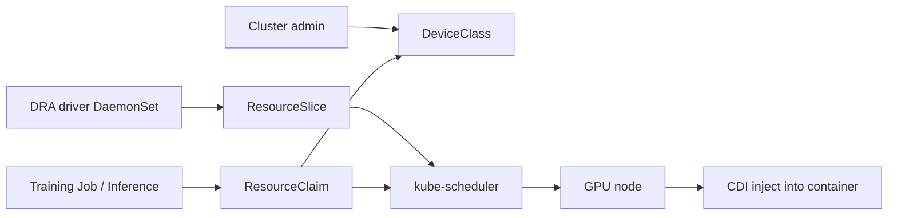
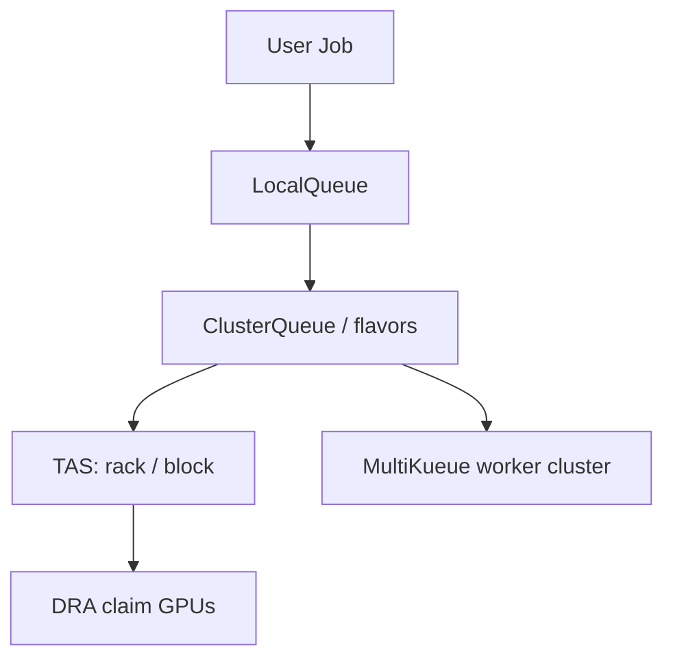

# AI/ML workloads, DRA, Kueue, KubeVirt, and edge

Kubernetes in 2026 is the default scheduler for GPU training, inference, and — increasingly — VMs that still wrap those stacks. The device-plugin era (`nvidia.com/gpu: 1` and hope) is being replaced by **Dynamic Resource Allocation (DRA)**. Batch fairness is **Kueue**. Gang scheduling is landing in core Kubernetes (beta in 1.37). VMs are **KubeVirt**. Edge is still **K3s** and **KubeEdge**.

Do not confuse these. DRA answers “which GPU, with which MIG slice, on which NUMA node.” Kueue answers “whose Job runs next when the GPUs are full.” The scheduler’s new Workload / PodGroup APIs answer “all-or-nothing placement so you do not deadlock 7 of 8 workers.”

## What it is

### GPU scheduling on Kubernetes

Historically: the [Device Plugin](https://kubernetes.io/docs/concepts/extend-kubernetes/compute-storage-net/device-plugins/) advertised an extended resource; the kubelet allocated a whole device; the scheduler only knew a count. No sharing, no CEL filters, no “H100 else A100,” no NUMA alignment except via Topology Manager after the fact.

**2026 path:**

1. Install a **DRA driver** for the device (NVIDIA donated its GPU DRA driver to the Kubernetes community at KubeCon Europe 2026; Google donated a TPU driver; both DRA and those drivers are GA in GKE).
2. The driver publishes `ResourceSlice` objects describing devices and attributes.
3. Admins define `DeviceClass` objects (e.g. `gpu-inference`, `gpu-train-h100`).
4. Workloads create a `ResourceClaim` or `ResourceClaimTemplate` with CEL selectors.
5. The scheduler allocates a matching device and binds the Pod to a node that can see it.

[DRA core is stable](https://kubernetes.io/docs/concepts/resource-management/dynamic-resource-allocation/) since Kubernetes **v1.35** and locked on (the `DynamicResourceAllocation` feature gate is ignored). Core APIs first went GA in [v1.34](https://kubernetes.io/blog/2025/09/01/kubernetes-v1-34-dra-updates/). v1.36–v1.37 added prioritized lists (stable), device taints (stable in 1.37), extended-resource-via-DRA (stable in 1.37 — the migration off device plugins), ResourceClaim device status (stable in 1.37), and alpha work on CPU/memory-via-DRA, derived attributes, and device compatibility groups (MIG vs vGPU).

**Limitations that still matter:** the scheduler **cannot preempt** a Pod to steal its DRA device for a higher-priority Pod ([upstream limitation](https://kubernetes.io/docs/concepts/resource-management/dynamic-resource-allocation/#limitations)). Device taints let you *avoid* a bad GPU; they do not implement fair preemption. Use Kueue preemption for queue-level fairness.

### Kueue

[Kueue](https://kueue.sigs.k8s.io/) is SIG-Scheduling’s Kubernetes-native job queue. It admits Workloads into **ClusterQueues** (quota, flavors, preemption) and **LocalQueues** (namespace-facing). It understands Job, JobSet, MPIJob, RayJob, PyTorchJob, and plain Pods.

Current release on the project README: **v0.19.2**, tested on Kubernetes **1.34+**. v0.19 started aligning with upstream Workload-Aware Scheduling (WAS). 2026 roadmap items include MultiKueue UX, topology-aware scheduling (TAS) elastic workloads, and integration with the in-tree WAS/PodGroup APIs.

**MultiKueue** dispatches a Job to a worker cluster that has quota. **Topology-Aware Scheduling** places tightly coupled workers on the same rack/block so GPU-GPU fabrics (NVLink, InfiniBand) actually work.

### Gang scheduling (core Kubernetes)

[KEP-4671](https://github.com/kubernetes/enhancements/issues/4671) gang scheduling is **beta in Kubernetes 1.37**, with workload-aware preemption ([KEP-5710](https://github.com/kubernetes/enhancements/issues/5710)) also beta. A PodGroup is scheduled all-or-nothing so distributed training does not pin seven GPUs and wait forever for the eighth. This does **not** replace Kueue: Kueue still owns quota, fairness, and multi-cluster dispatch. The two are converging (Kueue’s SchedulerLibraryIntegration gate, WAS controller APIs).

HPA **scale-to-zero** (beta, default on in 1.37) helps idle inference: object/external metrics only, not CPU.

### KubeVirt

[KubeVirt](https://kubevirt.io/) runs VMs as Pods (`VirtualMachine` / `VirtualMachineInstance`). It is a CNCF incubating project. **v1.9.0** supports Kubernetes 1.34–1.36 ([support matrix](https://github.com/kubevirt/sig-release/blob/main/releases/k8s-support-matrix.md)). Live migration, including decentralized live migration since v1.6, is real; **cross-cluster** live migration still depends on the network (EVPN/VXLAN and projects like OpenPERouter), not on a kubevirt.io magic flag.

Use KubeVirt when a workload is a VM (Windows, licensed appliance, nested GPU driver you have not containerized) and you want it on the same scheduler, NetworkPolicy, and GitOps path as containers. It is also how several “AI clouds” rent whole GPU machines without teaching the customer Kubernetes.

### Edge: K3s and KubeEdge

- **[K3s](https://k3s.io/)** is a CNCF-graduated, single-binary Kubernetes distribution. Latest line as of late August 2026: **v1.36.4+k3s1** (etcd, containerd, Traefik, CoreDNS bundled). Use it for retail, factory, or a single-node control plane that still speaks the Kubernetes API.
- **[KubeEdge](https://kubeedge.io/)** extends a cloud Kubernetes control plane to edge nodes with offline tolerance (Device CRDs, EdgeCore). Use it when nodes must keep running local control loops while the WAN is down.

Neither replaces DRA/Kueue in a GPU superpod. They *are* how you run a distilled model next to a camera.

## When to use

| Need | Tool |
| --- | --- |
| Allocate specific GPUs / MIG / NICs with CEL | DRA + vendor driver |
| Fair share of a GPU cluster among teams | Kueue ClusterQueues |
| All-or-nothing multi-Pod training | Gang scheduling (1.37 beta) + Kueue |
| Burst to another cluster’s idle GPUs | MultiKueue |
| Rack/block locality for NCCL | Kueue TAS + DRA NUMA attributes (`resource.kubernetes.io/numaNode`, stable in 1.37) |
| Run a VM on the same cluster | KubeVirt |
| Shop-floor / retail node | K3s |
| Cloud control plane, offline edge workers | KubeEdge |
| Idle inference that should cost $0 | HPA scale-to-zero (external metrics) + Karpenter consolidation |

## When NOT to use

- **Do not run training Jobs as naked Deployments** with `nvidia.com/gpu` and no queue. You will livelock GPUs.
- **Do not enable every DRA alpha feature** (CPU-via-DRA, compatibility groups) on a payments cluster that happens to have a T4 for fraud models. Stay on the stable DeviceClass / ResourceClaim path.
- **Do not expect DRA preemption.** High-priority inference will sit Pending if a low-priority trainer holds the device. Use Kueue preemption or a dedicated inference NodePool.
- **Do not use Kueue as a generic Deployment autoscaler.** It is for queued, finite (or at least admit-controlled) work. Use HPA/KEDA for request-driven services.
- **Do not live-migrate KubeVirt VMs across clusters** without a network design. Same-cluster live migration is the supported default.
- **Do not run K3s as your PCI production control plane** unless you have an HA etcd/Kine story and a patch process that matches your bank’s. K3s is excellent at the edge and in labs; it is not Autopilot.
- **Do not mix device plugin and DRA for the same GPUs** without a migration plan. 1.37’s extended-resource-via-DRA exists so you can stop doing that.

## Trade-offs

| Approach | Gain | Cost |
| --- | --- | --- |
| Device plugin only | Simple manifests | No sharing, no attributes, no fallback SKUs |
| DRA | Expressive allocation, sharing, taints, status | New CRDs, driver maturity, scheduler limitation on preemption |
| Kueue | Fairness, flavors, multi-cluster | Another controller; Job APIs to adopt |
| Core gang scheduling | No extra CRD for min-count | Beta; still need Kueue for quota |
| Time-slicing / MIG | Density | Isolation and performance variance |
| KubeVirt | VMs on K8s | Nested virt, extra agents, storage classes for VM disks |
| K3s | Tiny footprint | Distro skew, bundled components you must still patch |

## Gotchas

1. **ResourceClaim namespace.** Claims are namespaced. A platform DeviceClass is cluster-scoped. Tenants should not be able to create DeviceClasses that select someone else’s branded GPUs; RBAC the CRDs.
2. **CDI and runtime.** DRA attaches devices through the Container Device Interface. containerd must be new enough; kind/k3s versions lag cloud AMIs.
3. **Topology Manager vs DRA.** Topology Manager still exists for CPU/memory pinning. DRA has its own NUMA attribute. 1.37’s pod-level resource managers (beta, **off** by default) and DRA derived attributes (alpha) are how these meet. Do not enable both experimental paths in production without a topology lab.
4. **Kueue + Cluster Autoscaler / Karpenter.** If Kueue has not admitted the Job, there is no unschedulable Pod, so Karpenter will not scale. That is usually what you want (quota first). For “always have a warm GPU node,” run a separate provisioner or a dummy admitted placeholder.
5. **MultiKueue and secrets.** Dispatching a Job to a worker cluster copies spec, not your cloud credentials. Inject identity on the worker (IRSA / Workload Identity), not in the Job YAML.
6. **KubeVirt + Cilium.** Live migration and Multus extra networks need explicit Cilium/CNI config. Treat VM NICs as first-class NetworkPolicy subjects.
7. **Edge GPUs.** Jetson-class devices often lack the DRA driver you installed in the cloud. Device plugin on K3s is still the pragmatic edge path in 2026.
8. **Cost.** OpenCost 1.121 added Kubernetes **inference cost tracking**. GPU idle is the expensive bug; pair Kueue with consolidation and scale-to-zero.

## A reasonable AI node pool

- One Karpenter/Autopilot NodePool (or GKE GPU node pool) **tainted** for training, one for latency-sensitive inference.
- DRA DeviceClasses: `gpu-train` (H100/B200, whole device), `gpu-infer` (MIG slices or L4).
- Kueue ClusterQueues with borrowed quota so overnight training can steal idle inference GPUs, and **cannot** steal them during business hours (preemption policy + cohort).
- Gang scheduling enabled once you are on 1.37 and have tested the beta.
- Tetragon + NetworkPolicy so a training Job cannot exfiltrate weights through the research namespace.

## Sources

- [Dynamic Resource Allocation](https://kubernetes.io/docs/concepts/resource-management/dynamic-resource-allocation/)
- [Kubernetes v1.34: DRA has graduated to GA](https://kubernetes.io/blog/2025/09/01/kubernetes-v1-34-dra-updates/)
- [Kubernetes v1.36 DRA updates](https://kubernetes.io/blog/2026/05/07/kubernetes-v1-36-dra-136-updates/)
- [Kubernetes v1.37 release](https://kubernetes.io/blog/2026/08/26/kubernetes-v1-37-release/)
- [GKE: DRA for device management](https://cloud.google.com/blog/products/containers-kubernetes/kubernetes-device-management-with-dra-dynamic-resource-allocation/)
- [Kueue](https://github.com/kubernetes-sigs/kueue)
- [KubeVirt](https://kubevirt.io/) and [K8s support matrix](https://github.com/kubevirt/sig-release/blob/main/releases/k8s-support-matrix.md)
- [K3s releases](https://github.com/k3s-io/k3s/releases)
- [KubeEdge](https://kubeedge.io/)
