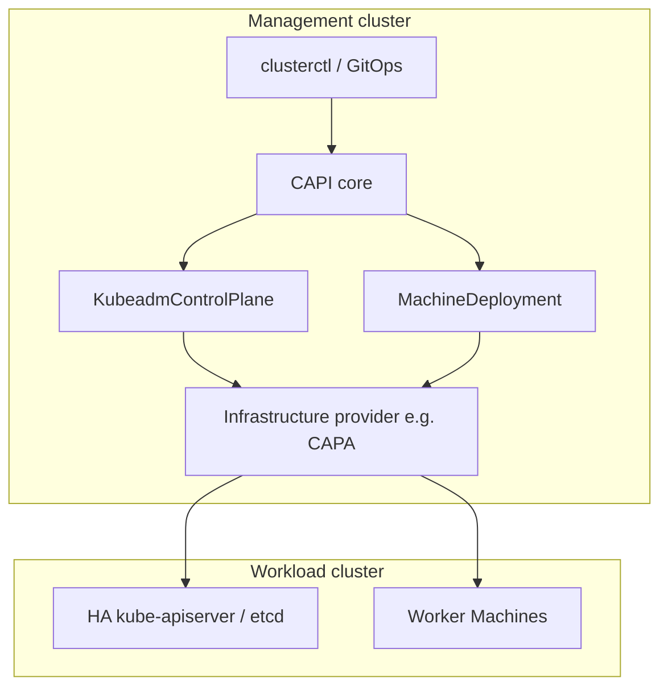
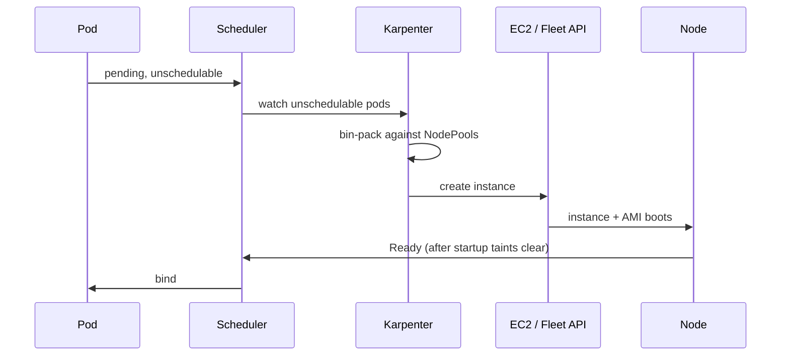

# Control plane and node lifecycle

Cluster lifecycle in 2026 is split in two: **who owns the control plane**, and **who owns the machines that run Pods**. Cluster API (CAPI) is the portable language for the first. Karpenter (or an Autopilot-style managed node pool) is the default answer to the second on public cloud. Cluster Autoscaler is still the right tool when you need node-*group* semantics across clouds.

As of September 2026: [Cluster API v1.14.1](https://github.com/kubernetes-sigs/cluster-api/releases) is current (management clusters Kubernetes 1.33–1.37, workload clusters 1.31–1.37). [Karpenter AWS provider v1.14.1](https://github.com/aws/karpenter-provider-aws/releases) is the LTS line, with the `karpenter.sh/v1` NodePool API that has been stable since Karpenter 1.0. AWS documents [EKS Auto Mode](https://docs.aws.amazon.com/eks/latest/best-practices/automode.html) as the recommended successor to self-managed Karpenter *and* to EKS Fargate for most new clusters. GKE Autopilot remains Google’s equivalent managed data plane.

## What it is

### Cluster API

[Cluster API](https://cluster-api.sigs.k8s.io/) is a Kubernetes-SIG project that represents clusters, machines, and machine deployments as CRDs. A **management cluster** runs CAPI providers (core, bootstrap, control-plane, infrastructure). Those controllers create **workload clusters**. The same API works on AWS, Azure, GCP, vSphere, bare metal (CAPM3 / Tinkerbell), and others.

CAPI v1.12 introduced [in-place updates and chained upgrades](https://kubernetes.io/blog/2026/01/27/cluster-api-v1-12-release/): you can patch a running machine without delete-and-recreate, and you can ask a ClusterClass topology to walk several Kubernetes minor versions in one operation instead of clicking through 1.34 → 1.35 → 1.36 yourself. v1.14 continues that line and adds Kubernetes 1.37 workload support from v1.14.1.



### Karpenter versus Cluster Autoscaler

Both watch unschedulable Pods. They differ in *what they scale*.

| | [Cluster Autoscaler](https://github.com/kubernetes/autoscaler/tree/master/cluster-autoscaler) | [Karpenter](https://karpenter.sh/) |
| --- | --- | --- |
| Scales | Pre-created node groups (ASG / MIG / VMSS) | Individual nodes via the cloud API (EC2 Fleet on AWS) |
| Instance choice | Whatever the group already allows | Any type matching NodePool requirements, chosen at launch |
| Scale-up latency | Typically minutes (group health, launch templates) | Typically tens of seconds on AWS |
| Scale-down | Underutilized node removal | Consolidation: empty, then underutilized, then cheaper replacement |
| Spot | Separate groups + node termination handler | First-class, mixed with on-demand in one NodePool |
| Cloud coverage | AWS, GCP, Azure, many others | AWS is production-grade; Azure provider exists; GCP is limited |
| API | Flags + group autoscaling | `NodePool` + cloud `NodeClass` (`EC2NodeClass` on AWS), `karpenter.sh/v1` |

Karpenter’s model: the scheduler marks a Pod unschedulable → Karpenter computes a NodeClaim that satisfies the Pod (and as many siblings as will fit) → the cloud provider launches that instance → the node joins → the Pod binds. Consolidation continuously asks “is there a cheaper or smaller node that still fits?”.



### Managed Autopilot-style node pools

**GKE Autopilot.** [Autopilot](https://cloud.google.com/kubernetes-engine/docs/concepts/autopilot-overview) is a GKE mode where Google owns node configuration, scaling, repair, and a large slice of security defaults. You pay for Pod resource requests, not for VMs you forgot to turn off. Since GKE 1.32.3-gke.1927002 Autopilot includes a container-optimized compute platform for general-purpose work; requesting specific hardware (GPUs, particular machine families) switches you onto a hardware-plus-node-management-premium billing model. You can also run Autopilot *workloads* inside a Standard cluster.

**EKS Fargate vs EKS Auto Mode.** [AWS Fargate for EKS](https://docs.aws.amazon.com/eks/latest/userguide/fargate.html) still runs each Pod in an isolated micro-VM. It cannot run DaemonSets, privileged Pods, or many host-network tools; Istio and similar platform add-ons have historically been painful. [EKS Auto Mode](https://docs.aws.amazon.com/eks/latest/userguide/auto-migrate-fargate.html) is AWS’s 2024–2026 answer: a Karpenter-based, Bottlerocket data plane that AWS patches, with built-in VPC CNI, EBS CSI, AWS Load Balancer Controller, and GPU / Neuron / NVIDIA drivers. Auto Mode supports GPUs, Spot, and standard Kubernetes primitives that Fargate does not. AWS’s current guidance is to **migrate Fargate workloads to Auto Mode** and treat Auto Mode as the default for new EKS clusters. You can run Auto Mode nodes next to managed node groups during migration.

**AKS.** Azure’s closest analogue is [node autoprovisioning](https://learn.microsoft.com/en-us/azure/aks/node-autoprovision) (Karpenter-based) plus the existing Virtual Nodes / Azure Container Instances path. Prefer NAP for Kubernetes-conformant workloads.

## When to use

**Cluster API** when:

- You operate **more than a handful of clusters** and want GitOps of the cluster itself (`Cluster`, `ClusterClass`, MachineDeployments).
- You need the same lifecycle API on **bare metal and cloud**.
- You are a platform team offering Kubernetes-as-a-service (CAPI is what most private-cloud and many public-cloud “managed Kubernetes” products wrap).

**Karpenter** when:

- The cluster is on **AWS** (or Azure NAP) and workloads are heterogeneous.
- Scale-from-zero batch, CI, or traffic spikes matter.
- You want mixed Spot + on-demand without maintaining a matrix of node groups.

**EKS Auto Mode / GKE Autopilot** when:

- You want Karpenter-class bin-packing **without running the controller**.
- Patching AMIs and add-ons is not a core competency of the team.
- You can live with the provider’s opinionated OS (Bottlerocket / Container-Optimized OS), max node lifetime (EKS Auto Mode: 21 days), and supported instance families.

**Cluster Autoscaler** when:

- You are **multi-cloud** and want one scaler.
- Capacity is **reserved / committed** to specific instance types and must stay in those groups.
- Governance requires every compute change to flow through an Auto Scaling Group (or equivalent) with an existing IAM/audit story.
- You run on-prem with CAPIs MachineDeployments and just need to grow/shrink those deployments.

## When NOT to use

- **Do not use Cluster API** to manage a single EKS/GKE cluster you will never recreate. The managed service *is* the control-plane lifecycle. CAPI on top of a managed control plane is justified only if you already standardize on CAPI for everything else (see CAPA + EKS managed control plane patterns).
- **Do not use Karpenter** as a substitute for HPA, KEDA, or VPA. Karpenter adds *nodes*. Horizontal/vertical *Pod* scaling is a different controller. Also do not run Karpenter and Cluster Autoscaler on the same node groups — they will fight.
- **Do not put privileged, hostNetwork, or DaemonSet-dependent platform agents on Fargate.** Use Auto Mode or a tiny managed node group for kube-system.
- **Do not assume Autopilot/Auto Mode is cheaper.** It is cheaper when you were bad at bin-packing. It is more expensive when you already run dense, long-lived, reserved instances at high utilization.
- **Do not in-place-update production control planes with an untested CAPI extension.** In-place updates in v1.12+ are an *extension point*; the default kubeadm path is still replace-the-machine unless you install and test an update extension.

## Trade-offs

| Choice | Upside | Downside |
| --- | --- | --- |
| Managed control plane | HA etcd, upgrades, IAM integration | Less visibility; version lag vs upstream; add-on compatibility is the vendor’s matrix |
| CAPI self-managed control plane | Portable, GitOps-able, works on bare metal | You own etcd backup, certificate rotation, and upgrade sequencing |
| Karpenter | Speed, density, Spot | AWS-centric; disruption surprises; instance-type churn complicates performance debugging |
| Cluster Autoscaler | Predictable groups, multi-cloud | Slow; over-provision; group explosion |
| Autopilot / Auto Mode | Least operational load | Constraints on node access, DaemonSets, sysctls, max lifetime; harder to run “pets” |
| Fargate | Per-Pod isolation | Not Kubernetes-complete; no GPU/Spot; AWS now points new work at Auto Mode |

## Current status and versions

- **Cluster API:** v1.14.x standard support; v1.13.x standard; v1.12.x in maintenance since the v1.14.0 cut (18 August 2026). Kubernetes compatibility is documented in the [CAPI version book](https://cluster-api.sigs.k8s.io/reference/versions.html). Workload 1.37 requires CAPI ≥ v1.13.6 or ≥ v1.14.1.
- **Karpenter:** `NodePool` / `NodeClaim` APIs are `karpenter.sh/v1`. AWS `EC2NodeClass` is `karpenter.k8s.aws/v1`. Provider v1.14.x lists Kubernetes 1.29–1.36; check the chart before pointing a 1.37 cluster at it.
- **EKS Auto Mode:** GA; AWS continues to add Load Balancer Controller features (through AWS LBC v3.4 as of August 2026). Gateway API on Auto Mode’s managed LBC is **not** supported yet — run a separate Gateway controller if you need it.
- **GKE Autopilot:** GA; Autopilot is the default cluster mode for many new GKE users. Workload identity, shielded nodes, and restricted Pod Security are on by default.
- **EKS Fargate:** still supported, no longer the recommended default for new compute.

## Gotchas

1. **Cilium startup taints.** If Cilium is not ready, Pods scheduled onto a brand-new Karpenter node black-hole. Set a startup taint on the NodePool (`node.cilium.io/agent-not-ready=:NoExecute`) so Karpenter waits. This is documented in the [NodePool concept page](https://karpenter.sh/docs/concepts/nodepools/).
2. **PDBs vs consolidation.** Karpenter respects PodDisruptionBudgets, but a PDB of `minAvailable: 100%` (or a singleton without a PDB) either blocks consolidation forever or allows a lone replica to be killed. Pair every Deployment with a PDB *and* `topologySpreadConstraints`.
3. **Do-not-disrupt annotation.** `karpenter.sh/do-not-disrupt: "true"` on a Pod is an escape hatch, not a platform policy. If half your namespace wears it, you have rebuilt Cluster Autoscaler’s “never scale down” problem.
4. **Volume attach limits.** Kubernetes 1.37 graduates CSI-aware Cluster Autoscaler scale-up ([KEP-5030](https://github.com/kubernetes/enhancements/issues/5030)) to beta. Karpenter is **not** Cluster Autoscaler; until a given Karpenter version accounts for CSI attach limits the same way, a node can be launched that cannot mount all the volumes the pending Pods need. Watch `CSINode` and per-driver attach limits on large stateful pools.
5. **EKS Auto Mode hides instances.** Starting 22 April 2026, new Auto Mode EC2 instances and related ENIs/EBS volumes are hidden from default EC2 list/describe views ([AWS docs](https://docs.aws.amazon.com/eks/latest/userguide/automode-learn-instances.html)). Your old “just grep the instance list” runbooks will return empty.
6. **Fargate → Auto Mode annotation.** AWS’s migration path is to set `eks.amazonaws.com/compute-type: ec2` so Fargate profiles stop claiming the Pod and Auto Mode NodePools pick it up. Do this per workload, not with a cluster-wide hammer, or you will evict things that still *need* Fargate isolation.
7. **Chained CAPI upgrades still honor skew.** Jumping 1.33 → 1.36 in one ClusterClass change is allowed, but kube-apiserver / kubelet skew policy still applies *during* the walk. Control plane first, then workers, per minor.
8. **Autopilot resource rounding.** Autopilot bills by request (and sometimes by a minimum CPU/memory grain). A 10m CPU request is not a 10m bill. Right-size requests or you will be shocked by the invoice while `kubectl top` looks idle.

## Minimal NodePool shape (AWS Karpenter)

Illustrative — not a drop-in for every account. See the [NodePool API](https://karpenter.sh/docs/concepts/nodepools/) for the full schema.

```yaml
apiVersion: karpenter.sh/v1
kind: NodePool
metadata:
  name: general
spec:
  disruption:
    consolidationPolicy: WhenEmptyOrUnderutilized
    consolidateAfter: 1m
  template:
    spec:
      nodeClassRef:
        group: karpenter.k8s.aws
        kind: EC2NodeClass
        name: default
      startupTaints:
        - key: node.cilium.io/agent-not-ready
          value: "true"
          effect: NoExecute
      requirements:
        - key: kubernetes.io/arch
          operator: In
          values: ["amd64"]
        - key: karpenter.sh/capacity-type
          operator: In
          values: ["on-demand", "spot"]
        - key: karpenter.k8s.aws/instance-category
          operator: In
          values: ["c", "m", "r"]
      expireAfter: 720h
```

Keep a **separate** on-demand NodePool for kube-system and for disruption-intolerant payments APIs; put batch and stateless frontends on the Spot-capable pool.

## Sources

- [Cluster API book — version support](https://cluster-api.sigs.k8s.io/reference/versions.html)
- [Cluster API v1.12: in-place updates and chained upgrades](https://kubernetes.io/blog/2026/01/27/cluster-api-v1-12-release/)
- [Cluster API v1.14.1 release](https://github.com/kubernetes-sigs/cluster-api/releases/tag/v1.14.1)
- [Karpenter NodePools](https://karpenter.sh/docs/concepts/nodepools/)
- [Karpenter AWS provider](https://github.com/aws/karpenter-provider-aws)
- [EKS Auto Mode best practices](https://docs.aws.amazon.com/eks/latest/best-practices/automode.html)
- [Migrate from EKS Fargate to EKS Auto Mode](https://docs.aws.amazon.com/eks/latest/userguide/auto-migrate-fargate.html)
- [GKE Autopilot overview](https://cloud.google.com/kubernetes-engine/docs/concepts/autopilot-overview)
- [Kubernetes Cluster Autoscaler](https://github.com/kubernetes/autoscaler/blob/master/cluster-autoscaler/README.md)
