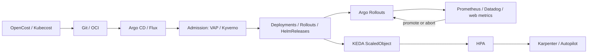

# GitOps, progressive delivery, policy-as-code, and cost

Delivery in 2026 is Git (or OCI) as the desired state, a reconciler that makes the cluster match, a **progressive** rollout that can abort on SLOs, and a cost/autoscaling loop that keeps the nodes you just provisioned honest.

The two CNCF-graduated reconcilers are [Argo CD](https://argo-cd.readthedocs.io/) **3.5.2** (26 August 2026) and [Flux](https://fluxcd.io/) **2.9.5** (31 August 2026). Progressive delivery on the Argo side is [Argo Rollouts](https://argoproj.github.io/rollouts/) **v1.9.1**. Event-driven scale is [KEDA](https://keda.sh/) **2.20.x**. Cost is [OpenCost](https://www.opencost.io/) (CNCF incubating; 1.121 added inference cost tracking) and the commercial [Kubecost](https://www.kubecost.com/) product built on the same engine. Vertical rightsizing is still [VPA](https://github.com/kubernetes/autoscaler/tree/master/vertical-pod-autoscaler), now sitting next to **stable in-place Pod resize**.

Policy-as-code is covered in depth in [security.md](security.md); this document only covers how it **gates delivery**.

## What it is

### Argo CD vs Flux

Both watch Git/OCI and apply Kubernetes manifests. They differ in architecture and UX.

| | Argo CD 3.5 | Flux 2.9 |
| --- | --- | --- |
| Shape | Application controller + API + UI + repo-server | Set of controllers (`source-controller`, `kustomize-controller`, `helm-controller`, `notification-controller`, `image-reflector/automation`) |
| UX | First-class web UI, SSO, RBAC, ApplicationSet preview (3.5) | CLI-first; optional Flux Operator dashboard |
| Multi-tenancy | Projects, AppProjects, impersonation (beta in 3.5) | Native: each tenant owns Kustomizations; controllers use the Kubernetes API, not a fat repo-server credential |
| Helm | Helm as an Application source; **Helm 4 support in 3.5** with Helm 3 compatibility | HelmRelease CRD, OCI Helm |
| OCI artifacts | Improving | Native from early Flux 2 |
| Image automation | Argo Image Updater (separate) | Built-in image-reflector + image-automation |
| Progressive delivery | Argo Rollouts (same org) | Flagger, or Rollouts as an add-on |
| Supply chain (2026) | Internal mTLS, commit signature verification, Source Hydrator beta | Long-standing Git verify (`spec.verify`); mTLS via `certSecretRef` on sources |
| CNCF | Graduated | Graduated |

**App-of-apps** (Argo) and **root Kustomization** (Flux) are the same idea: one Git repo generates the list of applications.

Argo CD 3.5 also graduates **Source Hydrator** (render in one repo, sync from another) to beta — useful when template authors and cluster-applied YAML must have different ACLs.

### Progressive delivery: Argo Rollouts

[Argo Rollouts](https://argoproj.github.io/rollouts/) replaces Deployment for workloads that need blue/green or canary. It speaks to Ingress, Gateway API, service meshes (Istio, Ambassador, …), and ALB to shift traffic by weight. **AnalysisTemplates** query Prometheus, Datadog, New Relic, web metrics, Job-based experiments, and more; a failed analysis pauses or aborts.

v1.9.x is the current 2026 line. Pair it with Gateway API HTTPRoute weights rather than with retired ingress-nginx annotations.

Flagger is the Flux-native analogue; it works, but this repository standardizes on Rollouts because the payments scenario already uses Argo CD.

### Policy-as-code in the delivery path

Three enforcement points, in order:

1. **CI** — `conftest`, `kyverno apply`, `gator test`, kubeconform, Helm lint. Fail the PR.
2. **Admission** — VAP / Kyverno / Gatekeeper. Fail the apply even if someone `kubectl`s around Git.
3. **Runtime** — Tetragon. Fail the process.

GitOps without (1) and (2) is a fast way to replicate a bad YAML everywhere. Kyverno’s generate rules **conflict** with GitOps if both try to own NetworkPolicy; pick one owner per object kind (see [security.md](security.md)).

ValidatingAdmissionPolicy is the cheapest gate for “Argo may not create a Service of type LoadBalancer in PCI namespaces.”

### Cost optimization: KEDA, Kubecost/OpenCost, VPA

**KEDA** (CNCF graduated) scales Deployments, Rollouts, jobs, and custom resources from event sources (Kafka, SQS, Prometheus, cron, …). **v2.20.2** (31 July 2026) supports Kubernetes 1.33–1.35 on the published matrix — verify 1.36/1.37 compatibility before upgrading those clusters. HPA scale-to-zero is beta in Kubernetes 1.37 for object/external metrics; KEDA has offered scale-to-zero for years and remains the practical choice for queue-driven workers.

**OpenCost** is the CNCF allocation engine. Kubecost wraps it with multi-cluster UI, governance, and support (free tier historically capped; enterprise is per-node). OpenCost **1.121.0** added Kubernetes inference cost tracking — relevant once DRA GPUs show up on the bill.

**VPA** recommends (or applies) CPU/memory requests. In 2026:

- Run VPA in **Off / recommendation** mode first, or use Goldilocks.
- [In-place Pod resize](https://kubernetes.io/docs/concepts/workloads/pods/pod-resize/) is **stable**; you can patch running Pods without a restart for many CPU/memory changes.
- Kubernetes 1.37 adds **alpha** scheduler preemption for in-place resize when the node is full. Do not enable that on PCI nodes yet.
- Do not run VPA auto-apply on JVM or GPU Pods without testing; memory downsizes still OOM.

Karpenter consolidation (see [control-plane-and-node-lifecycle.md](control-plane-and-node-lifecycle.md)) is the *node* half of cost. KEDA + VPA is the *Pod* half. OpenCost tells you whether the half you picked is the expensive one.

## When to use

| Situation | Choice |
| --- | --- |
| Platform team + app teams who want a UI | Argo CD + ApplicationSets |
| Git-only, strong tenant isolation, no UI requirement | Flux |
| Canary / blue-green with SLO abort | Argo Rollouts (or Flagger on Flux) |
| Kafka / SQS / cron workers | KEDA |
| Showback / chargeback / GPU $ | OpenCost; Kubecost if you need the enterprise UI |
| Rightsize requests | VPA recommend + in-place resize for safe bumps |
| Policy that must survive `kubectl` | Admission (not just CI) |

## When NOT to use

- **Do not run Argo CD and Flux against the same namespace.** They will thrash ownership.
- **Do not use Argo CD as a CI system.** Builds, image signing, and SBOMs belong in GitHub Actions / Tekton / whatever; Argo deploys the result.
- **Do not canary a database Schema Migration with Rollouts.** Progressive delivery is for stateless or explicitly dual-writable services.
- **Do not set KEDA `minReplicaCount: 0` on a payments API** that must meet a P99 latency SLO from a cold start. Warm min replicas, scale-to-zero the *async* workers.
- **Do not auto-apply VPA** on the first week. Recommendations + GitOps PRs beat surprise restarts.
- **Do not treat Kubecost savings recommendations as merge-ready.** They ignore PDBs, JVM heaps, and GPU bin-packing.
- **Do not pin production to an Argo CD version outside the [supported window](https://endoflife.date/argo-cd).** 3.5 / 3.4 / 3.3 are the supported lines as of August 2026.

## Trade-offs

| Choice | Gain | Cost |
| --- | --- | --- |
| Argo CD | UI, ApplicationSets, Rollouts synergy | Fat credentials in repo-server; harden 3.5 mTLS and impersonation |
| Flux | Smaller blast radius, Git-native, image automation | Weaker built-in progressive delivery and UI |
| Auto-sync | Cluster matches Git | A bad merge is live in 3 minutes — need Admission + Rollouts |
| Manual sync | Human gate | Drift and “works on the cluster I synced” |
| Rollouts canary | Fast abort | Extra CRDs; mesh/Gateway integration work |
| KEDA | Scale on real demand | Scaler credentials; over-scale if metrics are wrong |
| VPA auto | Less waste | Restarts (unless in-place) and bad recommendations |

## Gotchas

1. **Finalizers and stuck Applications.** Argo CD Applications with finalizers will block namespace deletion. Platform delete pipelines must know this.
2. **Helm + server-side apply.** Mix of `kubectl apply` SSA and Helm last-applied annotations causes field fights. Pick SSA cluster-wide (Argo CD supports it) and stay there.
3. **ApplicationSet generators.** A cluster-generator that points at the wrong label ships production values to a playground. Preview in 3.5 exists — use it.
4. **Flux `--prune` and generated resources.** If Kyverno generates a NetworkPolicy, Flux prune can delete it unless you exclude the label. Same class of bug as Argo’s `CompareOptions`.
5. **Rollouts + HPA.** HPA should target the Rollout, not a child Deployment you no longer own. Mis-pointing HPA is a classic outage.
6. **KEDA + Karpenter delay.** Scale-from-zero a Job that needs a GPU node: Kueue admit → Pod pending → Karpenter ~1 minute → image pull. SLO-sensitive inference should keep a warm pool.
7. **Cost allocation vs idle GPU.** OpenCost will show the namespace that *requested* the GPU. A shared inference Service needs a dedicated cost label or you will charge the platform team for every team’s tokens.
8. **In-place resize vs PDB.** Resizing memory up on a full node can fail or (in 1.37 alpha) preempt. PDBs do not express “this resize is optional.”
9. **Git as secret store.** SOPS / Sealed Secrets / External Secrets are fine. Plain `Secret` YAML in Git is an incident.

## Recommended delivery path (this repo)

1. GitHub (or equivalent) CI: kubeconform, Helm lint, Kyverno test, terraform fmt.
2. Merge to `main` → Argo CD Application (app-of-apps) auto-syncs **non-prod**.
3. Prod Applications are auto-sync **with** Rollouts canaries and a Prometheus AnalysisTemplate on error rate / latency.
4. KEDA on workers; HPA on APIs; VPA recommendations filed as PRs weekly.
5. OpenCost namespace allocation exported to the same Grafana that holds SLOs.

## Sources

- [Argo CD](https://argo-cd.readthedocs.io/) / [endoflife.date/argo-cd](https://endoflife.date/argo-cd)
- [Argo CD 3.5 supply-chain notes](https://www.infoq.com/news/2026/06/argocd-supply-chain-security/)
- [Flux](https://fluxcd.io/) / [endoflife.date/flux](https://endoflife.date/flux)
- [Argo Rollouts](https://argoproj.github.io/rollouts/)
- [KEDA](https://keda.sh/) / [endoflife.date/keda](https://endoflife.date/keda)
- [OpenCost](https://www.opencost.io/) / [CNCF OpenCost](https://www.cncf.io/projects/opencost/)
- [Vertical Pod Autoscaler](https://github.com/kubernetes/autoscaler/tree/master/vertical-pod-autoscaler)
- [In-place Pod resize](https://kubernetes.io/docs/concepts/workloads/pods/pod-resize/)
- [Kubernetes v1.37 — HPA scale to zero](https://kubernetes.io/blog/2026/08/26/kubernetes-v1-37-release/)
