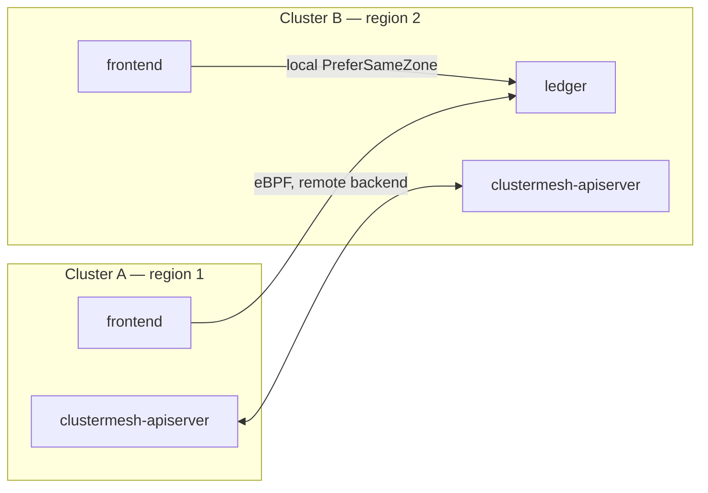
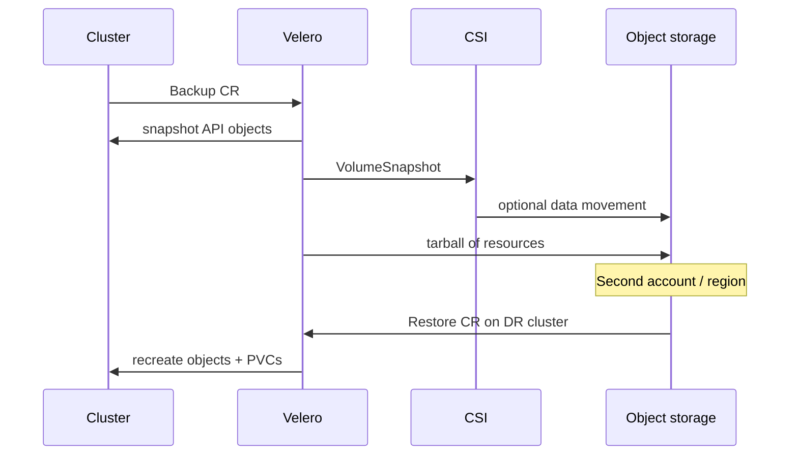

# Multi-cluster and resilience

One cluster is a failure domain. Resilience in 2026 is a **fleet** problem: how traffic, identity, backups, and disruption budgets behave when an AZ, a region, or a control plane dies.

The networking half is [Cilium Cluster Mesh](https://docs.cilium.io/en/stable/network/clustermesh/) plus the Kubernetes [Multi-Cluster Services API](https://github.com/kubernetes-sigs/mcs-api) (MCS-API). The lifecycle half is Cluster API, vCluster Platform, Open Cluster Management, Karmada, or a cloud fleet product. The data half is [Velero](https://velero.io/). The scheduling half is topology spread, `trafficDistribution`, and [PodDisruptionBudgets](https://kubernetes.io/docs/concepts/workloads/pods/disruptions/).

Istio ambient multi-cluster is **beta** (since 1.29); sidecar multi-cluster remains the conservative mesh path. Prefer Cilium Cluster Mesh for L3/L4 and GitOps for config unless you already live in Istio.

## What it is

### Cilium Cluster Mesh

Cluster Mesh connects Cilium identities, endpoints, and services across clusters. Pods keep their own CIDRs; eBPF on each node can send traffic **directly** to a remote Pod IP (native routing or encapsulation). There is no extra hop through a mesh gateway unless you choose a gateway datapath for overlapping CIDRs or private networks.

Two service models ([Cilium load-balancing docs](https://docs.cilium.io/en/latest/network/clustermesh/load-balancing/)):

| | MCS-API (`ServiceExport` / `ServiceImport`) | Cilium Global Services (annotations) |
| --- | --- | --- |
| Standard | SIG-Multicluster | Cilium-specific |
| DNS | `clusterset.local` (CoreDNS config; Cilium can manage it) | Same Service name via annotation |
| Properties | Globally reconciled (ports, type, sessionAffinity, `trafficDistribution`, …) | Per-cluster Service spec; more granular |
| Conflicts | Oldest Export wins, condition on status | You own the inconsistency |

Cilium 1.20 added a `cluster-mesh` policy entity and Cluster Mesh Service v2 work (EndpointSlice-like objects) to scale backends. Always set `clustermesh.policyDefaultLocalCluster` unless you *intend* NetworkPolicies to match remote clusters.

### Cluster fleet management

Cluster Mesh moves packets. It does not create clusters, push add-on versions, or revoke kubeconfigs. Fleet layers:

| Tool | Role | Use when |
| --- | --- | --- |
| [Cluster API](https://cluster-api.sigs.k8s.io/) + ClusterClass | Create / upgrade / delete clusters as CRDs | You own the infrastructure |
| Cloud fleets (EKS/GKE/AKS fleet, Anthos, Arc) | Managed control planes as a group | You standardized on one cloud |
| [vCluster Platform](https://www.vcluster.com/) | Virtual-cluster fleet, sleep/wake, templates | Tenants, not regions |
| [Open Cluster Management](https://open-cluster-management.io/) | Hub/spoke, ManifestWork, policy | Red Hat / multi-cloud hub |
| [Karmada](https://karmada.io/) | Multi-cluster scheduling of *workloads* | You want a control plane that places Deployments onto member clusters |
| [Rancher Fleet](https://fleet.rancher.io/) | GitOps to many clusters | Rancher is already the pane |
| Argo CD ApplicationSets / Flux Cluster generators | GitOps to many kubeconfigs | You already picked a GitOps tool |

[Karmada](https://karmada.io/) **graduated from the CNCF on 8 September 2026**
([announcement](https://www.cncf.io/announcements/2026/09/07/cloud-native-computing-foundation-announces-karmada-graduation/)),
having moved from Sandbox (2021) to Incubating (2023) and now to Graduated. The
v1.19 release promotes priority-based scheduling to beta (on by default) and
advances multi-component scheduling for distributed AI training; the roadmap
targets multi-cluster DRA across GPUs. For teams stretching GPU capacity or
workload placement across a fleet, Karmada is now a first-class default rather
than a "the Chinese cloud vendors use it" niche.

A payments platform typically wants: **CAPI or the cloud API** to exist the cluster, **Argo CD ApplicationSets** to configure it, **Cilium Cluster Mesh** only if active-active L4 failover is a documented RTO tactic.

### Velero (backup / DR)

[Velero](https://velero.io/) backups Kubernetes objects to object storage and volume data via **CSI snapshots** or **File System Backup** (node-agent, formerly restic/kopia). [Velero 1.18](https://github.com/vmware-tanzu/velero) is tested on Kubernetes 1.33–1.35 (the project lists expected compatibility as 1.18–latest; always check the matrix for 1.36/1.37).

| Method | Crash-consistent | Works for | Notes |
| --- | --- | --- | --- |
| CSI snapshot (+ optional move to object storage, since Velero 1.12) | Yes (if the driver is) | EBS, GCE PD, Azure Disk, vSphere CNS block | Preferred |
| File System Backup | No (hot copy) | NFS, EFS, emptyDir, local, anything without snapshots | Needs node-agent; not hostPath |
| Cloud-plugin snapshot | Yes | Legacy path for some clouds | Overlaps CSI |

Velero restores **into a cluster that already exists**. It is not Cluster API. Order of DR: create cluster (CAPI/cloud) → restore objects + volumes → redirect DNS/Gateway.

AWS also offers [Backup for EKS](https://aws.amazon.com/blogs/containers/back-up-and-restore-your-amazon-eks-cluster-resources-using-velero/) as a managed alternative; Velero remains the portable one.

**RTO / RPO (order-of-magnitude, not a promise):** scheduled CSI backups every 1 hour → RPO ≈ 1 hour plus snapshot lag. RTO is “how fast you can stand a cluster + restore + DNS,” often 30–90 minutes for a namespace, hours for a whole cluster, unless you keep a warm DR cluster.

### Topology-aware scheduling and traffic

Two different “topologies”:

1. **Where Pods land** — `topologySpreadConstraints`, node affinity, Kueue TAS, Topology Manager (NUMA). Spread replicas across `topology.kubernetes.io/zone`.
2. **Where bytes go** — Service `spec.trafficDistribution`.

`trafficDistribution` ([KEP-4444](https://github.com/kubernetes/enhancements/issues/4444), GA in 1.33) replaced the old topology annotations. In 1.34+ ([KEP-3015](https://github.com/kubernetes/enhancements/issues/3015)):

| Value | Meaning | Status |
| --- | --- | --- |
| `PreferSameZone` | Prefer endpoints in the client’s zone; fail open to other zones | GA; **use this** |
| `PreferSameNode` | Prefer same node, else anywhere | GA |
| `PreferClose` | Old name for same-zone | **Deprecated** in 1.34; still accepted |

Without spread constraints, `PreferSameZone` is a no-op that sometimes becomes a *single-zone* outage (all endpoints happened to schedule in zone a, clients in b hairpin or fail depending on implementation). Always pair them.

### PodDisruptionBudgets

A [PDB](https://kubernetes.io/docs/concepts/workloads/pods/disruptions/) limits *voluntary* disruptions (drains, Karpenter consolidation, upgrades). It does **not** block node death, `kubectl delete pod --force`, or an AZ failure.

Rules of thumb:

- APIs: `minAvailable: 2` or `maxUnavailable: 1` with at least 3 replicas and zonal spread.
- Singletons (a leader-elected controller): PDB of 0 unavailable **blocks drains**. Use `maxUnavailable: 1` only if you can tolerate a brief leader election, or exclude the node from consolidation.
- `unhealthyPodEvictionPolicy: AlwaysAllow` (stable) lets a drain proceed when Pods are already not Ready — useful so a crashloop does not freeze Karpenter.

Kubernetes 1.37’s alpha node lifecycle conditions (`DrainInProgress`, `Drained`, …) will make this more observable; they are not a substitute for PDBs.

## When to use

| Goal | Tooling |
| --- | --- |
| Active-active L4 across two clusters in one region | Cilium Cluster Mesh + MCS-API + `PreferSameZone` |
| Config and policy on 20 clusters | Argo CD ApplicationSets or Flux + CAPI |
| Place a Job on whichever cluster has GPUs | Kueue MultiKueue (see [ai-ml-workloads.md](ai-ml-workloads.md)) or Karmada |
| Survive region loss | Independent cluster in region 2, Velero restore or active-active with conflict-free data |
| Survive node drain / consolidation | PDBs + 3+ replicas + spread |
| Cut cross-AZ data transfer | `trafficDistribution: PreferSameZone` + spread |
| Tenant clusters, not regions | vCluster Platform, not Cluster Mesh |

## When NOT to use

- **Do not Cluster-Mesh clusters with overlapping Pod CIDRs** unless you enable a gateway / NAT datapath. Overlap is the classic “it works in the lab” outage.
- **Do not mesh prod and sandbox.** Identities and `cluster-mesh` policy entities will surprise you. Mesh *peers*, not *tiers*.
- **Do not treat Velero as HA.** A backup is for yesterday’s etcd, not for this minute’s in-flight payment.
- **Do not File-System-Backup a busy PostgreSQL PVC and call it crash-consistent.** Use CSI snapshots plus the database’s own backup (WAL shipping).
- **Do not set `minAvailable: 100%`.** You have frozen every drain and every consolidation.
- **Do not enable Istio ambient multi-cluster in production** while it is beta. Use sidecar multi-cluster or Cluster Mesh.
- **Do not restore a backup into a cluster of a different major CNI / Kubernetes skew** and expect PVs and identities to match.

## Trade-offs

| Pattern | RTO | Cost | Complexity |
| --- | --- | --- | --- |
| Single cluster, 3 AZs, PDBs | AZ: minutes; region: hours–days | Lowest | Lowest |
| Warm DR cluster, Velero restore | Region: tens of minutes–hours | Idle control plane + snapshots | Medium |
| Active-active Cluster Mesh | Region: seconds for stateless | 2× data plane | High (identity, IPAM, data consistency) |
| Fleet of many small clusters | Blast radius ↓ | Control-plane $ and GitOps | High |

Stateless frontends belong on the active-active row. Ledgers belong on the warm-DR + database-native replication row. Mixing those in one ServiceImport is how you split-brain.

## Gotchas

1. **etcd is not in a Velero backup the way you think.** Velero backs up *API objects*. The managed control plane’s etcd is the cloud vendor’s problem. After restore you still need IAM, DNS, certs, and Gateway addresses.
2. **Secrets in backups.** A Velero backup of a namespace is a secret dump. Encrypt the bucket, restrict IAM, and prefer CSI-mounted secrets that are *not* Kubernetes Secret objects (they will not restore the third-party vault, which is what you want — restore the *pointer*).
3. **CSI snapshot classes must exist on the DR cluster** with the same names, or PVC restore fails.
4. **MCS-API namespace must exist on both sides.** Exporting `payments/ledger` does nothing on a cluster that lacks the `payments` namespace.
5. **Global services and `internalTrafficPolicy: Local`.** Combining topology, Local traffic policy, and mesh backends can black-hole if a zone has no local Pod. Prefer `PreferSameZone` (fail-open) over Local (fail-closed) for multi-AZ APIs.
6. **Karpenter + PDB + Cluster Mesh.** Consolidation in cluster A can drop the last zonal replica that cluster B’s clients were hashing to. Spread *and* PDB *and* a minimum replica count that survives one node.
7. **Velero version vs Kubernetes.** 1.18’s published tests stop at 1.35. Validate 1.36/1.37 before you call the DR drill a success.
8. **`kubectl drain` vs Autopilot.** On GKE Autopilot / EKS Auto Mode you do not drain nodes the same way; the vendor’s max node lifetime (Auto Mode: 21 days) *is* a disruption generator. PDBs still apply.

## A payments-shaped DR sketch

- **Prod:** 3 AZs, Cilium, Gateway API anycast/DNS, `PreferSameZone`, PDBs on every Deployment, Karpenter NodePools that require zonal diversity.
- **DR region:** cluster created by the same CAPI/Terraform, add-ons GitOps-synced, **no** Cluster Mesh to prod (avoids stretching PCI).
- **Data:** Aurora/Cloud SQL / etcd-equivalent with native async replica; Velero hourly for Kubernetes objects + CSI for volume-backed append-only stores.
- **RPO:** 15 minutes for the ledger (database), 1 hour for cluster objects.
- **RTO:** 1 hour to serve read-only, 4 hours to full write after runbook (DNS, key material, freeze prod).
- **Drill:** restore to a scratch cluster monthly; a backup that has never been restored is theatre.

Details belong in `scenarios/fintech-payments/` runbooks, not here.

## Sources

- [Cilium Cluster Mesh](https://docs.cilium.io/en/stable/network/clustermesh/)
- [Cilium MCS-API / load-balancing](https://docs.cilium.io/en/latest/network/clustermesh/load-balancing/)
- [MCS-API](https://github.com/kubernetes-sigs/mcs-api)
- [Cluster API](https://cluster-api.sigs.k8s.io/)
- [Open Cluster Management](https://open-cluster-management.io/)
- [Karmada](https://karmada.io/)
- [Velero](https://velero.io/) / [GitHub](https://github.com/vmware-tanzu/velero)
- [Velero file system backup](https://velero.io/docs/main/file-system-backup/)
- [Pod disruptions / PDBs](https://kubernetes.io/docs/concepts/workloads/pods/disruptions/)
- [Service traffic distribution](https://kubernetes.io/docs/concepts/services-networking/service/#traffic-distribution)
- [KEP-3015 PreferSameZone / PreferSameNode](https://github.com/kubernetes/enhancements/issues/3015)
- [Istio ambient multicluster (alpha announcement)](https://istio.io/latest/blog/2025/ambient-multicluster/)
- [Istio 1.29 — ambient multi-network beta](https://istio.io/latest/news/releases/1.29.x/announcing-1.29/)
