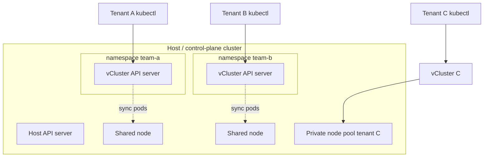
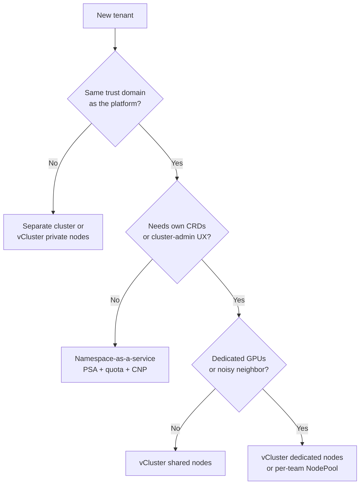

# Multi-tenancy and isolation

“Multi-tenant Kubernetes” is not one feature. It is a **spectrum of isolation** from “many Deployments in one namespace” up to “a dedicated cluster per customer.” In 2026 the practical options are:

1. **Soft / namespace-as-a-service** — RBAC, quotas, NetworkPolicy, Pod Security Admission, maybe vCluster on **shared nodes**.
2. **Virtual clusters** — [vCluster](https://www.vcluster.com/) (and similar) giving each tenant an API server and CRDs, with a choice of shared, dedicated, or private nodes.
3. **Hard multi-tenancy** — separate clusters (Cluster API / cloud accounts), or vCluster **private nodes**, plus per-tenant CNI/CSI and no shared kernel for untrusted workloads.

vCluster OSS is at **v0.37** (1 September 2026, default distro Kubernetes v1.36) with v0.36 still in support ([lifecycle policy](https://www.vcluster.com/docs/vcluster/manage/upgrade/supported_versions)). The product has grown from “a control plane in a Pod” into a tenancy *platform* (vCluster Platform v4.11) aimed at internal developer platforms and AI clouds.

## What it is

### Namespace-as-a-service (soft multi-tenancy)

The tenant gets a namespace (or a namespace hierarchy), a ServiceAccount, ResourceQuota, LimitRange, NetworkPolicy, and a PSA label (`pod-security.kubernetes.io/enforce=restricted`). The host API server, scheduler, etcd, CNI, and nodes are shared.

This is what most internal platforms still run for *trusted* application teams. It is also what every “you can install cert-manager in your namespace” request will eventually break — CRDs, webhooks, and ClusterRoles are cluster-scoped.

### vCluster / virtual clusters

A vCluster is a full Kubernetes API (typically k3s or vanilla kube-apiserver + backing store) running *on* a host cluster. From the tenant’s kubeconfig it looks like a cluster: they can install CRDs, controllers, and cluster-scoped objects that never appear on the host API. Workloads are synced onto the host (or onto private nodes) with rewritten names/metadata.

[vCluster’s tenancy models](https://www.vcluster.com/docs/vcluster/introduction/architecture):

| Model | Control plane | Workers | Isolation | Typical license |
| --- | --- | --- | --- | --- |
| **Shared nodes** | Virtual, on host | Host node pool | API + RBAC; **shared kernel and CNI** | OSS |
| **Dedicated nodes** | Virtual, on host | Host nodes selected by label | Compute isolation, still host CNI/CSI | OSS / platform |
| **Private nodes** | Virtual | Nodes join the vCluster directly | Separate CNI/CSI, no host workload visibility | Licensed (platform) |
| **vind** | In Docker, no host cluster | Containers | Dev/CI only | OSS |

vCluster is explicit: **shared nodes are not a security boundary for untrusted tenants.** Use them for internal developer environments, CI, and preview apps.

### Hard multi-tenancy patterns

“Hard” means a tenant cannot, by design, steal secrets or CPU from another tenant even if they run untrusted code as root in a Pod.

Building blocks that actually move the needle:

| Control | What it isolates | What it does not |
| --- | --- | --- |
| Separate cluster + cloud account | API, etcd, IAM, network, billing | Operational cost; you now have a fleet |
| vCluster private nodes | API + nodes + CNI/CSI | Host that still runs the virtual control plane |
| Dedicated node pools + taints + NetworkPolicy | Noisy neighbor (mostly) | Kernel exploits, node-local caches |
| Kata Containers / gVisor / Firecracker | Kernel (nested VM or userspace kernel) | Cluster-scoped API objects |
| Cilium + per-tenant identities | L3–L7 traffic | Compromised node |
| Separate etcd encryption keys / KMS per cluster | Secrets at rest | Secrets in a stolen node memory dump |

A payments platform that hosts *other companies’* code (a true SaaS) should start at **separate clusters** (or private-node vClusters) per tenant tier, not at namespaces.

### Namespace-as-a-service done properly

If tenants are employees, namespace-as-a-service is enough **if** you close the usual holes:

- **PSA Restricted** enforced, not just audit ([Pod Security Admission](https://kubernetes.io/docs/concepts/security/pod-security-admission/)).
- **NetworkPolicy / CiliumNetworkPolicy** default-deny, including DNS exceptions you can name.
- **ResourceQuota + LimitRange** so one team cannot etcd-DoS the API server with Secrets or CronJobs.
- **No tenant ClusterRoleBindings.** Grant `Role` in the namespace only. Use Kyverno/Gatekeeper to block `hostPath`, `Node` reads, and wildcard RBAC.
- **CRDs and operators** belong to the platform, not the tenant. If a team needs cert-manager or KEDA, the platform installs it once, namespaced where possible.
- **Admission** (ValidatingAdmissionPolicy or Kyverno) for labels, images, and egress.
- Optional: **vCluster on shared nodes** so the tenant *can* install a CRD without talking to you.

## When to use

| Situation | Pattern |
| --- | --- |
| 5–50 internal app teams, same trust domain | Namespaces + PSA + quota + NetworkPolicy |
| Teams need their own CRDs, Operators, or cluster-scoped test APIs | vCluster shared nodes |
| GPU / noisy-neighbor complaints, still internal | vCluster dedicated nodes or Karpenter NodePools per team |
| External customers, untrusted workloads, AI “GPU cloud” | vCluster private nodes **or** real clusters per tenant |
| Regulated payments *platform* (you run the software) | Separate PCI cluster (or namespace with extreme policy) for CDE; not a vCluster shared with CI |
| CI preview environments that live 30 minutes | vCluster or namespace auto-delete; never a cloud account |

## When NOT to use

- **Do not sell “namespace multi-tenancy” as hard isolation.** A `privileged: true` escape, a kubelet credential leak, or a kernel CVE is a cross-tenant incident.
- **Do not run untrusted tenant controllers against the host API.** That is how a tenant webhook takes down admission for everyone.
- **Do not put PCI cardholder data and a multi-tenant dev platform on the same nodes.** Scope is a network *and* a compute boundary.
- **Do not give tenants `cluster-admin` on the host** “because vCluster will isolate them.” vCluster isolation is only as strong as the syncer RBAC and the node model you chose.
- **Do not use a single shared ingress VIP with no Route-level policy** as the only tenant firewall. Gateway API `ReferenceGrant` and listener `allowedRoutes` exist for this.

## Trade-offs

| Pattern | Density / cost | Isolation | Ops load | Tenant UX |
| --- | --- | --- | --- | --- |
| Namespaces | Highest | Lowest | Low | Poor for CRDs |
| vCluster shared nodes | High | API isolation, weak runtime | Medium | Real cluster UX |
| vCluster dedicated nodes | Medium | Better noisy-neighbor | Medium | Real cluster UX |
| vCluster private nodes | Low | Strong | Higher (node join, CNI per tenant) | Closest to a real cluster |
| Cluster per tenant | Lowest | Strongest | Highest (fleet) | Native |

vCluster Platform adds sleep/wake, templates, SSO, and fleet observability so the “ops load” row for virtual clusters can beat “a thousand EKS clusters.” That is the point of the product. It is also a second control plane you must patch.

## Gotchas

1. **Syncer privilege.** The component that creates host Pods for a vCluster is powerful. Treat its RBAC, image, and network like kube-apiserver. Compromise of the host namespace of a vCluster is compromise of that tenant’s nodes.
2. **CRD and webhook storms.** Shared-node vClusters still run tenant controllers as Pods on the host. A tenant can burn CPU, etcd (on the *virtual* apiserver), and node PIDs. Quotas and Pod priority on the host namespace are mandatory.
3. **NetworkPolicy on the host vs inside the vCluster.** Tenants write policies against *virtual* identities. You still need host-level policy so tenant A’s synced Pods cannot talk to tenant B’s. Cilium cluster-wide policies or host NetworkPolicies are the backstop.
4. **Storage.** A RWX PVC on shared nodes is a data-isolation bug waiting for a wrong `claimRef`. Prefer per-tenant StorageClasses and encryption keys.
5. **Node selectors leak.** If dedicated-node vClusters are implemented only with a label the tenant can also set on a Pod, the tenant can schedule onto someone else’s pool. The platform must mutate/enforce node selectors, not trust the guest.
6. **Sleeping vClusters and GitOps.** Auto-sleep is great until Argo CD thrashes the virtual API server awake every three minutes. Exclude sleeping tenants from aggressive refresh, or use vCluster’s platform integration.
7. **Version skew.** vCluster 0.37 defaults to Kubernetes 1.36. The host can be 1.36 or 1.37; check the [compatibility matrix](https://www.vcluster.com/docs/vcluster/manage/upgrade/supported_versions) before mixing. Minor versions have a three-month active support window — this is not Kubernetes’ one-year window.
8. **Hard multi-tenancy and GPUs.** GPU devices are still a kernel resource. Without private nodes, MIG/DRA partitions, and device taints, “GPU multi-tenancy” is time-slicing with hope. See [ai-ml-workloads.md](ai-ml-workloads.md).

## Recommended decision flow

For this repository’s fintech scenario, *internal* squads (ledger, fraud, web) are namespaces on a shared PCI-scoped cluster. A hypothetical external sandbox or a data-science playground is a vCluster or a second cluster — never a namespace next to the cardholder data environment.

## Sources

- [vCluster architecture / tenancy models](https://www.vcluster.com/docs/vcluster/introduction/architecture)
- [What is vCluster?](https://www.vcluster.com/docs/vcluster/introduction/what-are-virtual-clusters)
- [vCluster lifecycle and version matrix](https://www.vcluster.com/docs/vcluster/manage/upgrade/supported_versions)
- [Kubernetes Pod Security Admission](https://kubernetes.io/docs/concepts/security/pod-security-admission/)
- [Kubernetes multi-tenancy WG / Hierarchical Namespace Controller](https://github.com/kubernetes-sigs/hierarchical-namespaces) (still relevant for namespace trees)
- [Cilium NetworkPolicy](https://docs.cilium.io/en/stable/security/policy/)
