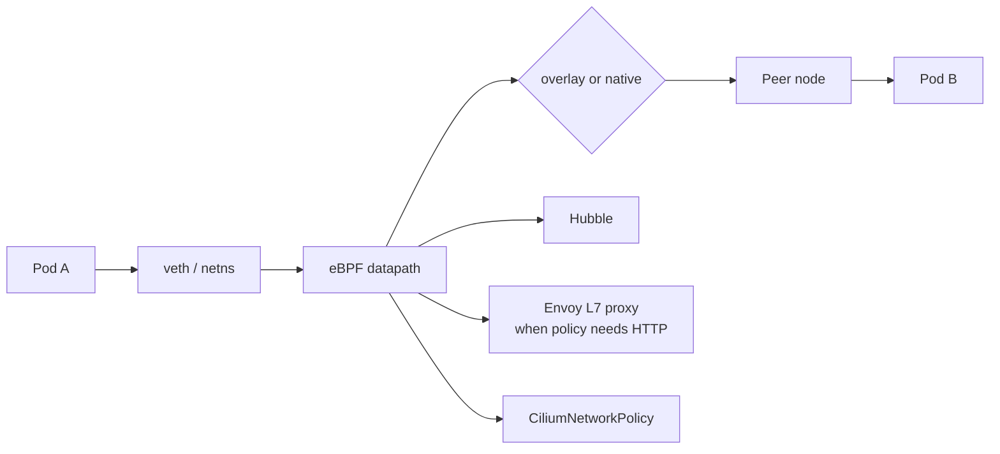
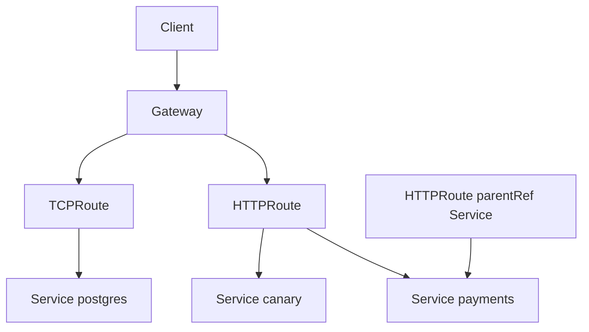
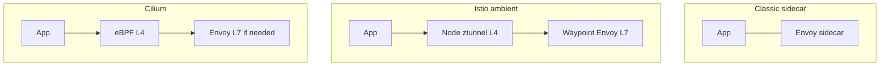

# Networking: Cilium, Gateway API, and the mesh evolution

Cluster networking in 2026 has three layers that used to be sold as separate products: **CNI** (Pods can reach Pods), **north-south routing** (the Internet can reach Services), and **service mesh** (identity, L7 policy, retries). The winning CNI is eBPF-based [Cilium](https://cilium.io/) (CNCF graduated, October 2023). The winning north-south API is [Gateway API](https://gateway-api.sigs.k8s.io/), whose Standard channel in v1.6 includes HTTP, gRPC, TLS, TCP, and UDP. The mesh question is no longer “Istio or Linkerd?” — it is “do you need L7 at all, and if so, sidecar, ambient, or Cilium’s Envoy datapath?”

Two calendar facts dominate this layer:

- The community [ingress-nginx controller retired in March 2026](https://kubernetes.io/blog/2025/11/11/ingress-nginx-retirement/). Existing Deployments still route traffic; they will never get another CVE patch.
- [Istio ambient mode](https://www.cncf.io/blog/2024/11/07/fast-secure-and-simple-istios-ambient-mode-reaches-general-availability-in-v1-24/) has been **GA since Istio 1.24** (November 2024). Current Istio is [1.31.0](https://istio.io/latest/news/releases/1.31.x/announcing-1.31/) (31 August 2026). Cilium 1.20 (July 2026) ships Gateway API 1.6.1 support.

## What it is

### Cilium (eBPF CNI)

Cilium replaces kube-proxy and a traditional CNI plugin with eBPF programs attached to kernel hooks (TC, XDP, cgroup, socket). It provides:

- Pod networking (VXLAN/Geneve overlay or native routing / cloud ENI)
- Identity-aware NetworkPolicy and CiliumNetworkPolicy (L3–L7)
- Hubble observability (flows, DNS, HTTP)
- kube-proxy replacement (eBPF service load-balancing)
- Optional Gateway API / Ingress, Cluster Mesh, and a service-mesh datapath (eBPF L4 + Envoy L7)

Cilium 1.20 added an extensible datapath plugin interface, IPv6 ENI IPAM (beta), Gateway API 1.6.1, MCS-API v0.5.2, and a `cluster-mesh` policy entity. Actively maintained branches as of mid-2026 included 1.19 and 1.18; prefer 1.20.x on new clusters.

### Gateway API

[Gateway API](https://gateway-api.sigs.k8s.io/) is a SIG-Network CRD set that replaces most Ingress use cases and, via the [GAMMA initiative](https://gateway-api.sigs.k8s.io/mesh/), also configures east-west mesh routing.

**Standard channel as of v1.6.1** ([project README](https://github.com/kubernetes-sigs/gateway-api), [v1.6 blog](https://kubernetes.io/blog/2026/08/03/gateway-api-v1-6-release/)):

| Resource | Status | Role |
| --- | --- | --- |
| GatewayClass | GA (`v1`) | Infrastructure: which controller implements Gateways |
| Gateway | GA | Listeners, addresses, TLS certs — Chihiro the cluster operator |
| HTTPRoute / GRPCRoute | GA | L7 routing — Ana the app developer |
| TLSRoute / TCPRoute / UDPRoute | GA in v1.6 | L4 / TLS passthrough |
| BackendTLSPolicy | GA (Standard since v1.4) | TLS from gateway to backend |
| ReferenceGrant | GA | Cross-namespace secret/service refs |
| ListenerSet | GA | Extra listeners without rewriting the Gateway |

Experimental resources now live in `gateway.networking.x-k8s.io` with an `X` prefix (e.g. `XBackend`). Do not put those in a PCI workload.

GAMMA (mesh) has been Standard since Gateway API v1.1.0: you attach HTTPRoutes to Services instead of Gateways, and the mesh datapath honors them. Istio and Cilium both implement this.

**Conformance at v1.6** (implementations with reports on the release day): Agentgateway, Airlock Microgateway, GKE Gateway, kgateway, NGINX Gateway Fabric, Traefik. Cilium documents Gateway API support independently in its [service mesh docs](https://docs.cilium.io/en/stable/network/servicemesh/).

### Service mesh: sidecar vs Istio ambient vs Cilium

A mesh is L4/L7 policy, mTLS identity, and telemetry **without changing application code**. Three production shapes exist in 2026:

| | Envoy sidecar (classic Istio / Linkerd-style) | Istio ambient | Cilium Service Mesh |
| --- | --- | --- | --- |
| Data plane | Envoy container in every Pod | Per-node **ztunnel** (Rust) for L4; optional **waypoint** Envoy for L7 | eBPF L4 in-kernel; Envoy only when L7 is configured |
| Upgrade | Restart every Pod to refresh the sidecar | Upgrade DaemonSet / waypoint independently | Upgrade Cilium / Envoy independently |
| mTLS | Proven, per-workload identity | GA; identity at ztunnel | Cilium mutual auth is **beta**; Hubble + policy identities exist at L3 |
| L7 (retries, HTTPRoute, JWT) | Full Envoy | Waypoint proxies (you opt in per Service/Namespace) | Envoy listeners / Gateway API / GAMMA |
| Multi-cluster | Istio multi-primary, GA for sidecars | Ambient multi-network: **beta** since Istio 1.29 | Cilium Cluster Mesh, production (see [multi-cluster doc](multi-cluster-and-resilience.md)) |
| Resource cost | Highest | Low L4, higher if every namespace gets a waypoint | Lowest L4; Envoy cost only where L7 is used |

Istio 1.29 enabled DNS capture and iptables reconciliation by default for ambient, and promoted multi-network ambient multi-cluster to beta. [Istio 1.31.0](https://istio.io/latest/news/releases/1.31.x/announcing-1.31/) (31 August 2026) is supported on Kubernetes **1.32–1.36** (not 1.37 yet). 1.31 adds weighted ambient waypoint canaries, zone-aware Envoy load balancing, and an `istio-agentgateway-waypoint` GatewayClass. Ambient + sidecar **coexistence** is a supported migration path (see OpenShift Service Mesh 3.4 notes based on Istio 1.30).

Cilium can **run next to Istio ambient**; the Cilium docs include a dedicated [Istio integration](https://docs.cilium.io/en/stable/network/servicemesh/istio/) page. Typical split: Cilium owns NetworkPolicy and Pod networking; Istio owns mTLS and L7 mesh.

## When to use

**Cilium as CNI** when you want one datapath for policy, observability, and (later) Gateway API / Cluster Mesh. This is the default in this repository.

**Gateway API** for every *new* ingress. It is the portable replacement for Ingress annotations. Use HTTPRoute for HTTP/gRPC, TCPRoute/UDPRoute for raw L4 (databases, DNS, game servers) as of v1.6.

**Istio ambient** when you need **workload identity and L7 policy** at fleet scale and you refuse to inject sidecars. Default to L4-only (ztunnel) and add waypoints only to the Services that need HTTP routing or JWT.

**Cilium Service Mesh / GAMMA** when Cilium is already the CNI, your L7 needs are modest (path routing, timeouts, Gateway API), and you do not want a second control plane.

**Sidecars** when a workload requires an Envoy filter, Wasm plugin, or retry/outlier behaviour that waypoints and Cilium Envoy do not yet expose, or when a compliance story is already written around per-Pod proxies.

## When NOT to use

- **Do not install a mesh “for observability.”** Hubble + OpenTelemetry sidecars (or eBPF) cover most of that without mTLS.
- **Do not run ingress-nginx in production after March 2026.** It is unmaintained. F5’s separate NGINX Ingress Controller and NGINX Gateway Fabric are different projects; community `ingress-nginx` is the retired one.
- **Do not enable Cilium L7 policy on every namespace on day one.** Every HTTP-aware rule redirects that traffic through Envoy and changes failure modes.
- **Do not treat Cilium mutual authentication as GA.** Docs still mark it **beta** with an explicit limitations list.
- **Do not put experimental Gateway API resources (`XBackend`, `XMesh`, `gateway.networking.x-k8s.io`) in regulated clusters.**
- **Do not mix kube-proxy iptables and Cilium kube-proxy-replacement without reading the upgrade guide.** Dual service datapaths duplicate or drop packets.
- **Do not assume ambient multi-cluster is GA.** It is beta as of Istio 1.29–1.31. Sidecar multi-cluster remains the conservative choice.
- **Do not put Istio 1.31 on Kubernetes 1.37** until the Istio support matrix lists it. 1.31’s published range is 1.32–1.36.

## Trade-offs

| Approach | Gain | Cost |
| --- | --- | --- |
| Cilium eBPF CNI | Fast, identity-aware policy, Hubble | Kernel version, privileged DaemonSet, migration from vpc-cni/Calico |
| Overlay (VXLAN) | Works anywhere | MTU, encapsulation CPU |
| Native routing / ENI | Performance, cloud-native IPs | IP exhaustion, routing table size, IPv6 ENI still beta in Cilium 1.20 |
| Gateway API | Portable, role-oriented, L4+L7 | Controller choice; annotation-to-Route rewrite |
| Ambient mesh | Cheap L4 mTLS, no sidecar upgrades | New failure domain (ztunnel); L7 is opt-in extra hops |
| Sidecar mesh | Maximum L7 fidelity | Memory, rolling upgrades, init-container races |
| Cilium-only mesh | One agent | Weaker L7 ecosystem than Istio; mTLS beta |

## Gotchas

1. **ingress-nginx snippets were a security incident class.** Gateway API implementations that re-introduce “raw config snippets” recreate IngressNightmare-class bugs. Prefer supported Route filters and implementation Policy CRDs.
2. **Cilium `policy-default-local-cluster`.** In Cluster Mesh, NetworkPolicies that select `cluster` entities can accidentally allow remote-cluster endpoints. Cilium 1.20 adds a `cluster-mesh` entity and a Helm flag `clustermesh.policyDefaultLocalCluster` — set it **on** unless you intend mesh-wide allow.
3. **Gateway listener `allowedRoutes`.** A Gateway that allows all namespaces is the new `Ingress class: nginx` with cluster-admin semantics. Bind listeners to the namespaces that should share that VIP.
4. **BackendTLSPolicy.** GA since Gateway API 1.4, but implementations vary. Without it, HTTPS to the Pod is often cleartext after the Gateway. For PCI, terminate *or* re-encrypt on purpose; do not leave it accidental.
5. **Istio ambient + `hostNetwork` / CNI chaining.** ztunnel relies on the Istio CNI to redirect traffic. Host-network Pods and some CNI chaining modes bypass it. Test kube-system and node-local agents explicitly.
6. **Envoy CVEs still exist.** Ambient reduces *how many* Envoys you run, not *whether* you patch them. Track Istio security bulletins (e.g. [ISTIO-SECURITY-2026-006](https://istio.io/latest/news/)).
7. **kube-proxy nftables.** Kubernetes is steering toward nftables; 1.37 improved netlink-based nftables performance and added localhost NodePort for nftables (alpha). Cilium’s kube-proxy replacement makes this mostly irrelevant — unless you disabled it.
8. **Source IP.** `externalTrafficPolicy: Local` plus Gateway API plus Cilium requires reading Cilium’s source-IP visibility docs. Health-check NodePorts and `PreferSameZone` Services interact.

## A concrete default for this repo

For the kind playground: Cilium (or kind’s default CNI) + a Gateway API CRD install is enough.

For the production payments scenario:

1. Cilium as CNI with kube-proxy replacement, Hubble, and CiliumNetworkPolicy default-deny in PCI namespaces.
2. Gateway API via Cilium *or* a dedicated controller (kgateway / Istio gateway) — one, not both, for the same GatewayClass.
3. No mesh until mTLS between `payments-api` and `ledger` is a documented control. Then Istio ambient L4, waypoints only on those two Services.
4. Migrate any leftover Ingress objects with Cilium’s [Ingress-to-Gateway guides](https://docs.cilium.io/en/stable/network/servicemesh/ingress-to-gateway/ingress-to-gateway/).

## Sources

- [Cilium documentation](https://docs.cilium.io/)
- [Cilium service mesh](https://docs.cilium.io/en/stable/network/servicemesh/)
- [Gateway API docs](https://gateway-api.sigs.k8s.io/)
- [Gateway API v1.6: TCPRoute and UDPRoute graduate to Standard](https://kubernetes.io/blog/2026/08/03/gateway-api-v1-6-release/)
- [Gateway API v1.4](https://kubernetes.io/blog/2025/11/06/gateway-api-v1-4/)
- [Ingress NGINX retirement](https://kubernetes.io/blog/2025/11/11/ingress-nginx-retirement/)
- [Istio ambient GA (1.24)](https://www.cncf.io/blog/2024/11/07/fast-secure-and-simple-istios-ambient-mode-reaches-general-availability-in-v1-24/)
- [Istio 1.29 announcement](https://istio.io/latest/news/releases/1.29.x/announcing-1.29/)
- [Istio 1.31.0 announcement](https://istio.io/latest/news/releases/1.31.x/announcing-1.31/)
- [GAMMA](https://gateway-api.sigs.k8s.io/mesh/)
