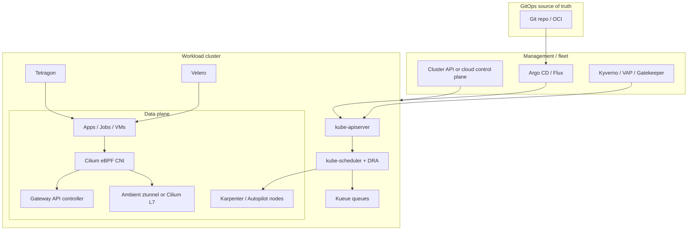
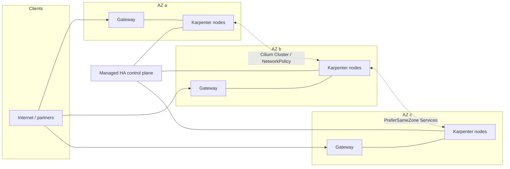

# Kubernetes cluster architecture in 2026

Kubernetes in 2026 is no longer “a cluster plus a CNI plus Helm.” A production platform is a **stack of specialized controllers** that together own node lifecycle, networking, policy, delivery, and recovery. The control plane is still kube-apiserver / etcd / scheduler / controller-manager, but almost every interesting operational property now lives *around* that core: Cluster API or a managed Kubernetes service for cluster lifecycle, Karpenter or an Autopilot-style node pool for compute, Cilium for eBPF networking, Gateway API for north-south traffic, GitOps for desired state, and DRA for GPUs.

This document is the map. The sibling deep-dives go into each layer. Facts below reflect the ecosystem as of September 2026: Kubernetes [v1.37.0 “Garhwal”](https://kubernetes.io/blog/2026/08/26/kubernetes-v1-37-release/) (released 26 August 2026) is current, with [1.37 / 1.36 / 1.35](https://kubernetes.io/releases/) on the supported release branches.

## What this series covers

| Layer | File | 2026 headline |
| --- | --- | --- |
| Control plane and nodes | [control-plane-and-node-lifecycle.md](control-plane-and-node-lifecycle.md) | Cluster API v1.14; Karpenter `v1` NodePools; EKS Auto Mode / GKE Autopilot |
| Networking | [networking.md](networking.md) | Cilium 1.20; Gateway API v1.6 (TCP/UDP GA); Istio ambient (GA since 1.24) |
| Multi-tenancy | [multi-tenancy.md](multi-tenancy.md) | vCluster shared vs private nodes; namespace-as-a-service vs hard isolation |
| AI/ML and mixed workloads | [ai-ml-workloads.md](ai-ml-workloads.md) | DRA GA (locked since 1.35); Kueue; gang scheduling beta in 1.37; KubeVirt; edge |
| Security | [security.md](security.md) | PSA + CEL ValidatingAdmissionPolicy; Kyverno (CNCF graduated); Tetragon; secrets |
| Delivery and cost | [gitops-and-delivery.md](gitops-and-delivery.md) | Argo CD 3.5 vs Flux 2.9; Argo Rollouts; KEDA; OpenCost / Kubecost; VPA |
| Multi-cluster and DR | [multi-cluster-and-resilience.md](multi-cluster-and-resilience.md) | Cilium Cluster Mesh + MCS-API; Velero; topology-aware traffic; PDBs |

## When to use this model

Use the 2026 “modern stack” when:

- You are building a **platform** (internal developer platform, regulated workload, multi-team SaaS), not a single-app cluster.
- You expect **heterogeneous compute** (spot + on-demand, mixed instance families, GPUs, maybe VMs).
- You need **policy, identity, and audit** that survive a cluster rebuild.
- You are migrating off **ingress-nginx**, which [retired in March 2026](https://kubernetes.io/blog/2025/11/11/ingress-nginx-retirement/) and no longer receives security patches.

Do **not** copy the full production stack onto a laptop, a one-node k3s box, or a two-week prototype. For those, kind + a CNI + kubectl is enough; this repo’s `clusters/kind` playground is the right entry point.

## The recommended modern stack

There is no single correct vendor, but there *is* a coherent default for a new production cluster in 2026. Pick the left column unless a constraint in the right column forces a different choice.

| Concern | Default | When to deviate |
| --- | --- | --- |
| Kubernetes version | Latest *supported* minor on your cloud (today: 1.36 on most managed services; 1.37 just shipped) | Stay on N-1 until add-ons (Cilium, Karpenter, CSI) list 1.37 |
| Cluster lifecycle | Managed control plane (EKS / GKE / AKS) **or** [Cluster API](https://cluster-api.sigs.k8s.io/) if you need multi-cloud / on-prem fleets | kubeadm by hand only for labs |
| Node lifecycle | [Karpenter](https://karpenter.sh/) (AWS) or Autopilot / Auto Mode | Cluster Autoscaler if you need multi-cloud node-group semantics or reserved capacity pinned to ASGs |
| CNI | [Cilium](https://cilium.io/) (eBPF, NetworkPolicy, Hubble, optional Gateway API) | Cloud-vendor CNI when the account already mandates it *and* you can still run Cilium in chaining/overlay mode |
| North-south traffic | [Gateway API](https://gateway-api.sigs.k8s.io/) (v1.6 Standard channel) | Keep Ingress only as a temporary shim; do not start new work on ingress-nginx |
| Service mesh | **None**, until you have a concrete L7 need. Then [Istio ambient](https://istio.io/latest/docs/ambient/overview/) *or* Cilium + Envoy waypoints | Sidecars only for workloads that need Envoy filters ambient/Cilium cannot yet express |
| Isolation | Namespaces + PSA Restricted + NetworkPolicy for trusted teams; [vCluster](https://www.vcluster.com/) (or separate clusters) for untrusted / CRD-heavy tenants | “Hard” multi-tenancy is never a namespace |
| GPUs / devices | [Dynamic Resource Allocation](https://kubernetes.io/docs/concepts/resource-management/dynamic-resource-allocation/) + vendor DRA driver; [Kueue](https://kueue.sigs.k8s.io/) for queues | Device plugins only as a compatibility shim (DRA can now satisfy extended-resource requests) |
| Policy | Pod Security Admission + [ValidatingAdmissionPolicy](https://kubernetes.io/docs/reference/access-authn-authz/validating-admission-policy/) (CEL) for simple rules; [Kyverno](https://kyverno.io/) for mutation / generation / image verify | OPA/Gatekeeper when Rego is already an org-wide language |
| Runtime defense | [Tetragon](https://tetragon.io/) (eBPF) | Falco if you want a large off-the-shelf rule library and detection-only |
| Secrets | External secret store (Vault, cloud KMS) + Secrets Store CSI *or* External Secrets Operator | Never long-lived Kubernetes Secret objects as the source of truth |
| Delivery | [Argo CD](https://argo-cd.readthedocs.io/) app-of-apps + [Argo Rollouts](https://argo-rollouts.readthedocs.io/) | Flux when you want a fully Git-native, UI-optional, multi-tenant controller set |
| Scale / cost | HPA + [KEDA](https://keda.sh/) + Karpenter consolidation + [OpenCost](https://www.opencost.io/) / Kubecost | VPA in **recommendation** mode first; in-place resize is stable, but auto-apply is still operationally sharp |
| Backup / DR | [Velero](https://velero.io/) with CSI snapshots + object storage | File-system backup only for volume types that cannot snapshot |
| Multi-cluster | Cilium Cluster Mesh (MCS-API) for L3/L4; GitOps for config; Velero for state | Full service-mesh multi-cluster only when you need L7 identity across clusters |

### How the pieces fit

Read the diagram left-to-right: Git is the desired-state store; a GitOps controller applies it; admission policy is the last gate before the API server; the scheduler plus DRA and Kueue decide *where* work runs; Karpenter (or Autopilot) materializes the nodes those decisions need; Cilium plus Gateway API move packets; Tetragon watches syscalls; Velero copies state off-cluster.

## Kubernetes 1.37 in one paragraph

[v1.37](https://kubernetes.io/blog/2026/08/26/kubernetes-v1-37-release/) (67 enhancements: 16 stable, 23 beta, 27 alpha) is an AI-and-operations release more than a “new object types” release. DRA device taints, extended-resource-via-DRA, and ResourceClaim device status are **stable**. Gang scheduling and workload-aware preemption are **beta**. HPA can scale to zero (beta, default on) for object/external metrics. KYAML and `metrics.k8s.io/v1` are stable. Pod certificates and ClusterTrustBundles are stable. On the datapath, kube-proxy continues the move toward nftables; IPVS and cgroup v1 are on the way out. Do not enable every alpha feature in this release on a payments cluster.

## A reference topology

The topology below is what this repository’s production scenario (`scenarios/fintech-payments/`) aims at: multi-AZ, GitOps-driven, Cilium-segmented, Karpenter-scaled.

Zone-aware Services (`spec.trafficDistribution: PreferSameZone`, GA since 1.33 and renamed from `PreferClose` in 1.34 — see [KEP-3015](https://github.com/kubernetes/enhancements/issues/3015)) keep east-west traffic inside an AZ when a local endpoint exists. PodDisruptionBudgets and topology spread constraints keep the scheduler from stacking every replica in one zone. Velero snapshots go to a **different** account/region than the cluster.

## Trade-offs of the modern stack

| You gain | You pay |
| --- | --- |
| Fast node provisioning and bin-packing (Karpenter / Autopilot) | Less predictable instance types; need disruption budgets and consolidation controls |
| One eBPF datapath for NetworkPolicy, observability, and optional mesh | Kernel / distro requirements; a CNI migration is a project, not a Helm flag |
| Portable L4/L7 routing (Gateway API v1.6) | Every annotation you loved on Ingress has to be re-expressed as a Route/Policy |
| Sidecar-less mesh (ambient or Cilium) | L7 feature parity with “classic” Envoy sidecars is still incomplete in places |
| DRA for GPUs | Drivers, DeviceClasses, and ResourceClaims are a new operational surface |
| GitOps + policy-as-code | Two sources of denial (Git drift *and* admission) — debug both |
| Multi-cluster | Identity, IPAM, and DNS become fleet problems |

## Gotchas that bite new platforms

1. **Version skew is the real SLA.** Cluster API v1.14.1 supports management clusters 1.33–1.37 and workload clusters 1.31–1.37 ([version book](https://cluster-api.sigs.k8s.io/reference/versions.html)). Cilium 1.20 tracks Kubernetes 1.36 and Gateway API 1.6.1. Karpenter 1.14 lists Kubernetes 1.29–1.36. A “we upgraded the control plane on Tuesday” without checking add-on matrices is how clusters go dark.
2. **ingress-nginx is unmaintained.** Existing Deployments still route packets. They will not get CVE patches. Gateway API is the portable replacement; Cilium, kgateway, NGINX Gateway Fabric, Traefik, GKE Gateway, and Istio all have [v1.6 conformance reports](https://kubernetes.io/blog/2026/08/03/gateway-api-v1-6-release/).
3. **Namespaces are not a security boundary for untrusted code.** Combine PSA, NetworkPolicy, and quota for *trusted* multi-tenancy. Use vCluster private nodes or separate clusters for anything that looks like a customer.
4. **Device plugins and DRA can double-count.** Kubernetes 1.37’s extended-resource-via-DRA path is the migration off device plugins. Running both for the same GPU without a plan wastes capacity or fails scheduling.
5. **Spot + consolidation + PDBs.** Karpenter will happily disrupt a node that looks empty if the PDB is wrong or missing. Set `startupTaints` for Cilium (`node.cilium.io/agent-not-ready`) so pods do not land before the CNI is ready ([Karpenter NodePool docs](https://karpenter.sh/docs/concepts/nodepools/)).
6. **Secrets in etcd are not a vault.** Even with encryption at rest, a full etcd snapshot is a secret dump. Prefer CSI / ESO and short-lived tokens. Pod certificates graduated to stable in 1.37 if you want workload identity without a sidecar.
7. **Mesh is optional.** mTLS, retries, and L7 auth are real needs. Installing Istio “just in case” is how you inherit Envoy CVEs (see [ISTIO-SECURITY-2026-006](https://istio.io/latest/news/)) for no user-facing feature.

## How to read the rest of this directory

Start with the layer that is currently your bottleneck:

- Cluster sprawl or snowflake node groups → [control-plane-and-node-lifecycle.md](control-plane-and-node-lifecycle.md)
- Ingress retirement, NetworkPolicy, or mesh choice → [networking.md](networking.md)
- Platform-for-many-teams → [multi-tenancy.md](multi-tenancy.md)
- GPUs, batch, VMs, edge → [ai-ml-workloads.md](ai-ml-workloads.md)
- PSA / policy / runtime / secrets → [security.md](security.md)
- Delivery, rollouts, cost → [gitops-and-delivery.md](gitops-and-delivery.md)
- Fleet, backup, zonal traffic, disruption → [multi-cluster-and-resilience.md](multi-cluster-and-resilience.md)

Then implement only the slice you can operate. A small, well-run Cilium + Gateway API + Argo CD cluster beats a museum of every CNCF logo.

## Sources

- [Kubernetes releases](https://kubernetes.io/releases/)
- [Kubernetes v1.37 release blog](https://kubernetes.io/blog/2026/08/26/kubernetes-v1-37-release/)
- [Gateway API](https://gateway-api.sigs.k8s.io/) and [v1.6 release](https://kubernetes.io/blog/2026/08/03/gateway-api-v1-6-release/)
- [Ingress NGINX retirement](https://kubernetes.io/blog/2025/11/11/ingress-nginx-retirement/)
- [Cluster API version support](https://cluster-api.sigs.k8s.io/reference/versions.html)
- [Karpenter NodePools](https://karpenter.sh/docs/concepts/nodepools/)
- [Cilium](https://cilium.io/) / [Cilium docs](https://docs.cilium.io/)
- [Istio ambient overview](https://istio.io/latest/docs/ambient/overview/)
- [Dynamic Resource Allocation](https://kubernetes.io/docs/concepts/resource-management/dynamic-resource-allocation/)
