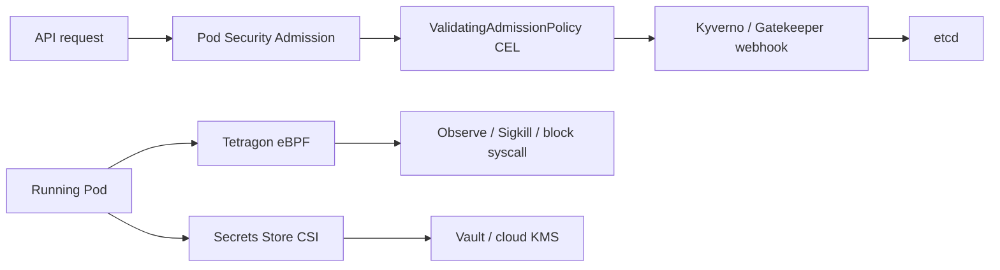

# Security: admission, policy-as-code, runtime, and secrets

Kubernetes security in 2026 is a **pipeline**, not a product. Admission decides what may exist. Policy-as-code decides what “good” means and mutates the rest. Runtime eBPF decides what a process may *do* after it starts. Secrets should never originate in etcd.

The built-in layer is stronger than it was in 2023:

- [Pod Security Admission](https://kubernetes.io/docs/concepts/security/pod-security-admission/) (PSA) has been the replacement for PodSecurityPolicy since 1.25.
- [ValidatingAdmissionPolicy](https://kubernetes.io/docs/reference/access-authn-authz/validating-admission-policy/) (CEL, in-process) has been GA since 1.30.
- [Pod certificates](https://kubernetes.io/docs/reference/access-authn-authz/certificate-signing-requests/#pod-certificate-requests) and [ClusterTrustBundles](https://kubernetes.io/docs/reference/access-authn-authz/certificate-signing-requests/#cluster-trust-bundles) graduated to **stable in 1.37**.
- Manifest-based admission (policies on disk, independent of etcd) is **beta in 1.37**.

On top of that, [Kyverno](https://kyverno.io/) graduated CNCF on 16 March 2026, [OPA/Gatekeeper](https://open-policy-agent.github.io/gatekeeper/) remains the Rego option, and [Tetragon](https://tetragon.io/) is the eBPF runtime enforcer that pairs naturally with Cilium.

## What it is

### Pod Security Admission

PSA enforces three [Pod Security Standards](https://kubernetes.io/docs/concepts/security/pod-security-standards/) — **Privileged**, **Baseline**, **Restricted** — per namespace via labels (`pod-security.kubernetes.io/enforce`, `audit`, `warn`, plus an optional version). Restricted is the 2026 default for application namespaces: no root, no host namespaces, drop capabilities, seccomp RuntimeDefault.

PSA does **not** cover NetworkPolicy, image provenance, volume types beyond the standard, or “must have these labels.” That is why everyone layers a policy engine.

### OPA/Gatekeeper vs Kyverno vs CEL

| | ValidatingAdmissionPolicy (CEL) | Kyverno | OPA Gatekeeper |
| --- | --- | --- | --- |
| Language | CEL | YAML + CEL (new types); legacy JMESPath deprecated | Rego |
| Runs | In kube-apiserver | Admission webhook + background controllers | Admission webhook + audit |
| Mutate | No (MutatingAdmissionPolicy is a separate, newer K8s API) | Yes | Yes (Assign / AssignMetadata) |
| Generate resources | No | Yes | No |
| Image signatures | No | Yes (Cosign, Notary) | Via [Ratify](https://rat.dev/) or external data |
| Audit existing objects | No | PolicyReports | Constraint status |
| CNCF | Built-in | **Graduated** March 2026 | OPA graduated 2021; Gatekeeper incubating |
| Overhead | Near zero | Low | Medium |

Kyverno 1.17 made CEL policy types (`ValidatingPolicy`, `MutatingPolicy`, `GeneratingPolicy`, `ImageValidatingPolicy`, `DeletingPolicy`) **v1 GA**. Kyverno **1.18** (May 2026) is the first post-graduation release. Legacy `ClusterPolicy` is deprecated and scheduled for **removal in Kyverno 1.20 (October 2026)**. New clusters should not create `ClusterPolicy`.

Gatekeeper is still the right hammer when Rego is already the company’s policy language (Terraform, Envoy, CI). It is the wrong hammer if the platform team lives in YAML and needs mutation/generation.

### Tetragon (eBPF runtime)

[Tetragon](https://github.com/cilium/tetragon) is Cilium’s runtime observability and **enforcement** agent. It attaches eBPF to kprobes, tracepoints, LSM hooks, and (in [v1.7](https://isovalent.com/blog/post/tetragon-v1.7-release), June 2026) fentry/fexit. It understands Kubernetes identities (pod, namespace, labels).

Unlike Falco (excellent detection rules, userspace decisions), Tetragon can **kill or block in-kernel** (`Sigkill`, syscall deny) without a round trip. That closes the TOCTOU window that userspace enforcers lose. v1.7 adds CEL-in-BPF filtering, environment-variable collection, and `matchParentBinaries` selectors.

Tetragon is not a PCI control by itself. It is how you prove that the payments API never exec’d `/bin/bash` and never opened `/etc/shadow`.

### Secrets: Secrets Store CSI and external providers

The [Secrets Store CSI Driver](https://secrets-store-csi-driver.sigs.k8s.io/concepts) mounts secrets from an external store as a `tmpfs` volume using a `SecretProviderClass` (`secrets-store.csi.x-k8s.io/v1`). Providers include Vault, Azure Key Vault, GCP Secret Manager, AWS Secrets Manager, and Akeyless.

[Vault’s CSI provider](https://developer.hashicorp.com/vault/docs/deploy/kubernetes/csi) authenticates as the **Pod’s ServiceAccount** (Kubernetes/JWT auth). HashiCorp documents support for Kubernetes 1.32–1.36 on current Vault. The Helm chart (`hashicorp/vault`, e.g. 0.34.x) can install CSI alongside the injector.

Two other patterns coexist:

- **Vault Agent Injector** — sidecar/init that writes files; good at lease renewal.
- **External Secrets Operator** — syncs into a Kubernetes Secret. Convenient for Helm charts that insist on `secretKeyRef`; worse for “never persist in etcd.”

Prefer CSI or injector for cardholder-adjacent secrets. If you must materialize a Kubernetes Secret (an Ingress TLS cert, a controller that cannot mount CSI), encrypt etcd at rest with a cloud KMS and rotate.

**Pod certificates (stable 1.37)** issue short-lived X.509 to a projected volume via `PodCertificateRequest`. This is the in-tree path toward workload identity without a SPIFFE sidecar — complementary to CSI, not a Vault replacement for arbitrary KV secrets.

## When to use

| Problem | Tool |
| --- | --- |
| Baseline Pod hardening | PSA Restricted on every app namespace |
| Simple “must have label / must not use latest” | ValidatingAdmissionPolicy |
| Mutate defaults, generate NetworkPolicy, verify Cosign | Kyverno |
| Org-wide Rego, shared with Terraform | Gatekeeper |
| Detect *and block* unexpected exec / network / file access | Tetragon |
| Broad detection rule library, no enforcement | Falco (often *with* Tetragon) |
| App reads a DB password | Secrets Store CSI → Vault / cloud KMS |
| Helm chart only accepts `secretKeyRef` | External Secrets Operator with a short sync TTL |
| mTLS identity without mesh | Pod certificates (1.37+) or SPIFFE/SPIRE |

## When NOT to use

- **Do not stop at PSA.** Restricted still allows a lot (any image, any egress, any ConfigMap).
- **Do not run Kyverno *and* Gatekeeper *and* a pile of VAPs that all deny the same thing.** Pick one mutating engine. VAP + Kyverno is a reasonable split (in-process basics + everything else).
- **Do not write new Kyverno `ClusterPolicy` objects** if you are on 1.17+. Migrate to CEL types before 1.20.
- **Do not use Tetragon as your only admission control.** It sees what *ran*, not what *was admitted*. A privileged Pod that never execs still has a privileged kubelet attack surface.
- **Do not store long-lived cloud root keys in Kubernetes Secrets.** IRSA / Workload Identity / Pod certificates.
- **Do not enable CSI `syncSecret` (creating a Kubernetes Secret from the mount) as the default.** That re-puts the secret in etcd, which is what CSI was avoiding.
- **Do not run policy webhooks with `failurePolicy: Ignore` on security rules.** An unavailable webhook then admits everything. HA the webhook, or use VAP / manifest-based admission for the rules that must work during an outage.

## Trade-offs

| Control | Strength | Weakness |
| --- | --- | --- |
| PSA | Free, in-process, hard to bypass | Coarse, namespace-scoped only |
| VAP / CEL | In-process, no extra pods | No mutation, no generate, no signatures |
| Kyverno | YAML-native, mutate/generate/verify | Webhook latency; CEL migration in 2026 |
| Gatekeeper | Expressiveness, inventory | Rego skill; mutation is second-class |
| Tetragon | In-kernel enforce, K8s-aware | Policy authoring is specialist work; kernel requirements |
| CSI secrets | Not in etcd, per-Pod | Restart to refresh (unless provider supports rotation + re-read); Windows support is limited |
| ESO | App-compatible | Secret lives in etcd |
| Pod certificates | In-tree identity | You must run a signer controller |

## Gotchas

1. **PSA `enforce` vs `enforce-version`.** A namespace labeled Restricted without a version uses the latest standard, which can break Pods on a cluster upgrade. Pin `pod-security.kubernetes.io/enforce-version` for production namespaces, and have a job that bumps it.
2. **Exempting kube-system.** PSA exemptions are cluster-wide. If you exempt too broadly, you have recreated Privileged. Prefer dedicated namespaces for node agents with Baseline, not cluster-wide exemptions.
3. **Webhook deadlocks.** Kyverno/Gatekeeper must not be subject to their own failing policies on their namespace. Use `failurePolicy` and namespace selectors carefully; keep policy-system on a node pool that does not require the webhook to schedule (host-network DaemonSets, priorityClass).
4. **Kyverno generate + GitOps.** If both Argo CD and Kyverno generate a NetworkPolicy, they will fight. Either Git owns it, or Kyverno owns it.
5. **Tetragon TracingPolicy scope.** A cluster-wide policy that Sigkills `unshare` will surprise legitimate builders. Start in monitor mode, namespace-scope the first enforce policies, and watch CPU — v1.7 is efficient, unbounded tracepoints are not.
6. **CSI and custom kubelet root.** Distros that move kubelet’s directory (some k3s, MicroK8s, Rancher) break CSI socket paths. Set `kubeletRootDir` to match.
7. **Vault leases vs CSI.** CSI’s Vault provider uses Agent for renewal; if that process dies, leases can be revoked under a running Pod. Test restart behaviour.
8. **Encryption-at-rest key loss.** Kubernetes 1.37 keeps beta support for deleting undecryptable objects through the API ([KEP-3926](https://github.com/kubernetes/enhancements/issues/3926)). That is a recovery tool, not a backup strategy. Velero *plus* KMS key backups.
9. **Image verification is only as good as the admission path.** CronJobs, Jobs, and controllers that create Pods must be in the match constraints. Empty `match` on an ImageValidatingPolicy is how “we verify everything” becomes “we verify Deployments.”

## A default posture for a payments cluster

1. PSA **Restricted** enforce on `payments-*` namespaces; Baseline on ingress/gateway namespaces that still need extra capabilities.
2. A handful of VAPs: deny `:latest`, require `app` / `cost-center` labels, deny `hostPath`.
3. Kyverno CEL policies: generate default-deny CiliumNetworkPolicy, verify Cosign signatures for production images, mutate `seccompProfile` if someone omitted it.
4. Tetragon TracingPolicies: alert on unexpected `exec`, block raw sockets in PCI namespaces, record file access to `/var/run/secrets`.
5. Vault + Secrets Store CSI for application secrets; Pod certificates or SPIFFE for workload-to-workload identity if you are not running a mesh.
6. Audit logs to an immutable store (cloud trail + Kubernetes audit). Tetragon events beside them, not instead of them.

## Sources

- [Pod Security Admission](https://kubernetes.io/docs/concepts/security/pod-security-admission/)
- [Pod Security Standards](https://kubernetes.io/docs/concepts/security/pod-security-standards/)
- [ValidatingAdmissionPolicy](https://kubernetes.io/docs/reference/access-authn-authz/validating-admission-policy/)
- [Kyverno CNCF graduation](https://www.cncf.io/announcements/2026/03/24/cloud-native-computing-foundation-announces-kyvernos-graduation/)
- [Kyverno 1.18](https://www.cncf.io/blog/2026/05/05/announcing-kyverno-release-1-18/)
- [Kyverno 1.17 / CEL GA](https://www.cncf.io/blog/2026/02/18/announcing-kyverno-1-17/)
- [OPA Gatekeeper](https://open-policy-agent.github.io/gatekeeper/website/)
- [Tetragon](https://tetragon.io/) / [v1.7](https://isovalent.com/blog/post/tetragon-v1.7-release)
- [Secrets Store CSI concepts](https://secrets-store-csi-driver.sigs.k8s.io/concepts)
- [Vault CSI provider](https://developer.hashicorp.com/vault/docs/deploy/kubernetes/csi)
- [Kubernetes v1.37 — Pod certificates](https://kubernetes.io/blog/2026/08/26/kubernetes-v1-37-release/)
