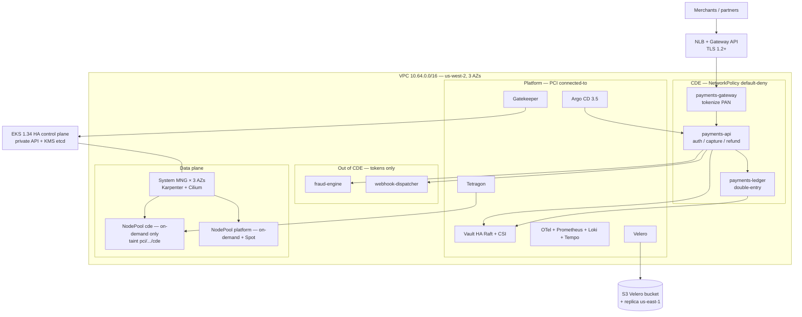

# Northstar Payments — production Kubernetes scenario

A regulated **card-not-present payment-processing platform** on Amazon EKS. This is the flagship scenario for the repo: multi-AZ, Karpenter-scaled, Cilium-segmented, GitOps-delivered, with PCI-DSS 4.0.1-flavored controls, progressive delivery, and a documented DR path.

It is **not** a QSA-certified product. It is a copy-paste-ready *architecture and IaC* that a platform team can take into a real AWS account, lock down, and hand to a QSA. The local playground remains [`clusters/kind`](../../clusters/kind); the generic EKS lab remains [`clusters/eks`](../../clusters/eks). This directory is the production shape.

## Business context

Northstar Payments acquires card-not-present transactions for online merchants: authorization, capture, refund, and settlement against card networks via a tokenized vault. Peak is Black Friday (roughly 20× weekday QPS). The cardholder data environment (CDE) must stay small, auditable, and restorable.

| Fact | Target |
| --- | --- |
| Availability | 99.95% monthly for the authorization path (about 22 min/month) |
| Authorization p99 | ≤ 250 ms in-region, excluding issuer think-time |
| RPO (AZ failure) | 0 (synchronous multi-AZ) |
| RTO (AZ failure) | ≤ 5 minutes, no human action |
| RPO (region failure) | 15 minutes |
| RTO (region failure) | 4 hours (standby EKS + Velero restore + DNS cutover) |
| Compliance | [PCI-DSS 4.0.1](https://www.pcisecuritystandards.org/document_library/) (mandatory since 31 March 2025) |

Primary region is `us-west-2` (three AZs). Disaster-recovery region is `us-east-1` (warm standby, documented in the [DR runbook](runbooks/disaster-recovery.md)).

PAN is tokenized at the edge. After the gateway, every service sees a token, never a PAN. That is the scoping decision that keeps fraud scoring and merchant webhooks *out* of the CDE.

## Architecture (one picture)



Control plane is Amazon-managed EKS across three AZs. Workload nodes are Karpenter `NodePool`s; a small on-demand managed node group exists only so Karpenter, Cilium, and CoreDNS have somewhere to run. Networking is Amazon VPC CNI **chained** with [Cilium 1.20](https://docs.cilium.io/en/stable/) for eBPF NetworkPolicy and Hubble. North-south traffic is [Gateway API](https://gateway-api.sigs.k8s.io/) (ingress-nginx [retired March 2026](https://kubernetes.io/blog/2025/11/11/ingress-nginx-retirement/)).

The deep-dive, including PCI scope mapping and RTO/RPO, is [architecture.md](architecture.md).

## Key decisions (and why)

| # | Decision | Why | ADR |
| --- | --- | --- | --- |
| 1 | Multi-AZ EKS 1.34, private API, KMS-encrypted secrets | AZ is not a failure domain we can accept for auth | [0001](decisions/0001-multi-az-eks.md) |
| 2 | Karpenter v1 over Cluster Autoscaler | Mixed instance types, Spot fallback for *non-CDE*, sub-minute scale-up | [0002](decisions/0002-karpenter-over-cluster-autoscaler.md) |
| 3 | Cilium CNI + default-deny NetworkPolicy | Identity-aware microsegmentation for PCI Req. 1 | [0003](decisions/0003-cilium-cni-networkpolicy.md) |
| 4 | Argo CD 3.5 app-of-apps | Git is the desired state; AppProject isolates CDE from platform | [0004](decisions/0004-argocd-gitops-app-of-apps.md) |
| 5 | Argo Rollouts canary + AnalysisTemplate | Auth path cannot go 100% on a bad build | [0005](decisions/0005-argo-rollouts-progressive-delivery.md) |
| 6 | Vault HA + Secrets Store CSI | No long-lived PAN/DEK in etcd | [0006](decisions/0006-vault-for-secrets.md) |
| 7 | OTel + Prometheus/Grafana + Loki + Tempo | One pipeline, PCI Req. 10 audit trail | [0007](decisions/0007-observability-stack.md) |
| 8 | Velero CSI snapshots → S3 (+ replica) | Portable restore; RPO 15 min / RTO 4 h for region loss | [0008](decisions/0008-velero-backup-dr.md) |
| 9 | Gatekeeper + PSA Restricted | Rego is the org policy language; PSA is the free baseline | [0009](decisions/0009-gatekeeper-and-psa.md) |
| 10 | Tetragon eBPF runtime | Prove the payments API never exec'd a shell | [0010](decisions/0010-tetragon-runtime-enforcement.md) |
| 11 | Gateway API, not Ingress | ingress-nginx is unpatched; Gateway API v1.6 is Standard | [0011](decisions/0011-gateway-api.md) |
| 12 | CDE NodePool is on-demand only | Spot interruption is an availability and tenancy risk in-scope | [0012](decisions/0012-cde-on-demand-nodes.md) |

## Table of contents

| Path | What it is |
| --- | --- |
| [architecture.md](architecture.md) | Control plane, data plane, network topology, HA/DR, PCI scope |
| [cost-and-compliance.md](cost-and-compliance.md) | Cost knobs and PCI-DSS 4.0.1 control mapping |
| [decisions/](decisions/) | Architecture Decision Records |
| [terraform/](terraform/) | Root module: VPC, EKS, Karpenter, Cilium, KMS, Velero bucket, IRSA |
| [gitops/](gitops/) | Argo CD app-of-apps, namespaces, NetworkPolicies, sample services |
| [policies/](policies/) | Gatekeeper ConstraintTemplates + Constraints |
| [runbooks/disaster-recovery.md](runbooks/disaster-recovery.md) | Velero restore, RTO/RPO, region failover |
| [runbooks/node-failure.md](runbooks/node-failure.md) | AZ drain, Karpenter disruption, instance failure |

## What you get when you apply Terraform

A three-AZ VPC, an EKS 1.34 cluster with all control-plane log types, a three-node **system** managed node group, Karpenter 1.14.1 (`NodePool`/`EC2NodeClass` v1), Cilium 1.20.1 chained on the VPC CNI, a KMS key for secrets encryption, an S3 bucket (versioned, encrypted, blocked public) for Velero, and IRSA/Pod Identity roles for Karpenter, Velero, and Vault auto-unseal.

GitOps, Gatekeeper, Vault, the observability stack, Tetragon, and the payment services are **not** created by Terraform. They are applied by Argo CD from `gitops/` after the cluster exists. That split is deliberate: infrastructure that must exist before GitOps (VPC, EKS, Karpenter, CNI) is Terraform; everything that reconciles from Git is Argo.

## Prerequisites

| Tool | Version | Notes |
| --- | --- | --- |
| Terraform | 1.5.7+ | `terraform version` |
| AWS CLI v2 | current | `aws sts get-caller-identity` must succeed |
| kubectl | 1.30+ |  |
| Helm | 3.14+ | Terraform drives Helm for Cilium/Karpenter; you need it for Argo bootstrap |
| Docker | — | Not required for this scenario (that is `clusters/kind`) |

IAM rights: EKS, EC2, IAM, VPC, SQS, EventBridge, CloudWatch Logs, KMS, S3, Helm-installed add-ons. The EC2 Spot service-linked role must exist:

```bash
aws iam create-service-linked-role --aws-service-name spot.amazonaws.com
```

(safe to ignore `InvalidInput` if it already exists).

**This cluster costs money** until you destroy it: EKS control plane, three NAT Gateways, three `m6i.large` system nodes, plus whatever Karpenter launches.

## Deploy

```bash
cd scenarios/fintech-payments/terraform
cp terraform.tfvars.example terraform.tfvars
# set region, cluster_name, and lock cluster_endpoint_public_access_cidrs to your IP/VPN

terraform init
terraform fmt -check
terraform validate
terraform plan -out=tfplan
terraform apply tfplan
```

First apply is 20–30 minutes. Then:

```bash
aws eks update-kubeconfig --region us-west-2 --name northstar-payments
kubectl get nodes -L karpenter.sh/registered,workload,pci.northstar.example/cde
kubectl get nodepool,ec2nodeclass
```

Bootstrap Argo CD and the app-of-apps (see [gitops/README.md](gitops/README.md)):

```bash
helm repo add argo https://argoproj.github.io/argo-helm
helm upgrade --install argocd argo/argo-cd --version 10.6.4 \
  --namespace argocd --create-namespace \
  --set global.domain=argocd.payments.internal \
  --set configs.params.server.insecure=false

helm template bootstrap gitops/charts/bootstrap \
  --set repoURL=https://github.com/YOUR_ORG/k8s-cluster-architectures \
  --set targetRevision=main \
  | kubectl apply -n argocd -f -
```

Replace `YOUR_ORG` with the Git remote that holds this repository. The bootstrap Application is the only object you apply by hand; every child Application is then created by Argo CD from Git.

## When to use / when NOT to use

**Use this** as the starting point for a real, regulated workload on EKS: multi-AZ NAT, KMS, Velero bucket, CDE taints, default-deny NetworkPolicy, Gatekeeper, Vault CSI, Rollouts.

**Do not use this** as a laptop cluster (use `clusters/kind`), as a cheap sandbox (use `clusters/eks` with `single_nat_gateway = true`), or as a drop-in PCI certification. A QSA will still want evidence: ASV scans, pentests of the CDE boundary ([Req. 11.4.5](https://www.pcisecuritystandards.org/document_library/)), a ROC, and a named QSA.

### Trade-offs

| Choice | You gain | You pay |
| --- | --- | --- |
| Self-managed Karpenter (not EKS Auto Mode) | Exact NodePool/taint control for CDE vs Spot | You patch the controller and CRDs |
| VPC CNI + Cilium chaining | Nodes Ready in one apply; eBPF policy | Not a full kube-proxy replacement until you migrate |
| Vault in-cluster HA Raft | Keys never leave your account; CSI mounts | You operate Raft, unseal, and backups |
| App-of-apps (not ApplicationSet) | Explicit, reviewable list of services | More YAML when the fleet grows |
| On-demand-only CDE nodes | No Spot interruption in-scope | Higher compute bill for the CDE |

### Gotchas

- **Destroy order.** Delete Karpenter NodePools and wait for nodes to terminate *before* `terraform destroy`, or ENIs/SGs will hang. See [`clusters/eks` README](../../clusters/eks/README.md).
- **PAN in logs.** If a stack trace prints a PAN, Loki is in the CDE. The architecture assumes application-level redaction plus Tetragon alerts on unexpected file/net activity.
- **GitOps vs Gatekeeper generate.** This repo lets Git own NetworkPolicy. Do not also let Gatekeeper generate the same objects.
- **AMI alias `al2023@latest`.** Fine for a lab; pin (`al2023@vYYYYMMDD`) before this cluster sees real transactions ([Karpenter AMI docs](https://karpenter.sh/docs/concepts/nodeclasses/#specamiselectorterms)).

## Versions pinned here (September 2026)

| Component | Version | Source |
| --- | --- | --- |
| EKS Kubernetes | 1.34 (standard support through 2026-12-02) | [EKS version calendar](https://docs.aws.amazon.com/eks/latest/userguide/kubernetes-versions.html) |
| Karpenter | 1.14.1 (K8s 1.29–1.36) | [endoflife.date/karpenter](https://endoflife.date/karpenter), [karpenter.sh](https://karpenter.sh/) |
| Cilium | 1.20.1 | [helm.cilium.io](https://helm.cilium.io/) |
| Argo CD | 3.5.2 / chart 10.6.4 | [argo-cd v3.5.2](https://github.com/argoproj/argo-cd/releases/tag/v3.5.2) |
| Argo Rollouts | 1.9.1 / chart 2.41.1 | [argo-rollouts](https://github.com/argoproj/argo-rollouts/releases) |
| Vault Helm | 0.34.1 (app 2.0.4) | [hashicorp/vault-helm](https://github.com/hashicorp/vault-helm/releases) |
| Tetragon | 1.7.1 (chart 1.7.0) | [cilium/tetragon](https://github.com/cilium/tetragon/releases) |
| kube-prometheus-stack | 88.6.1 | [prometheus-community charts](https://github.com/prometheus-community/helm-charts) |
| Gateway API | v1.6.1 Standard | [Gateway API v1.6](https://kubernetes.io/blog/2026/08/03/gateway-api-v1-6-release/) |
| Velero | 1.16+ (`velero.io/v1` CRs) | [velero.io](https://velero.io/docs/main/api-types/backupstoragelocation) |
| terraform-aws-eks | ~> 20.37 | AWS provider 5.x constraint; 21.x needs provider 6 |

## License and secrets

Do not commit `terraform.tfvars`, `.env`, Vault unseal keys, or kubeconfigs. There are no placeholder passwords in this tree; every Secret is either generated by Terraform (`random` is not used for passwords — we do not store them) or mounted from Vault at runtime via CSI.
