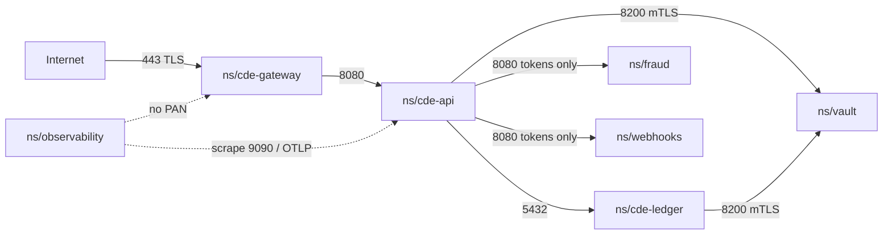
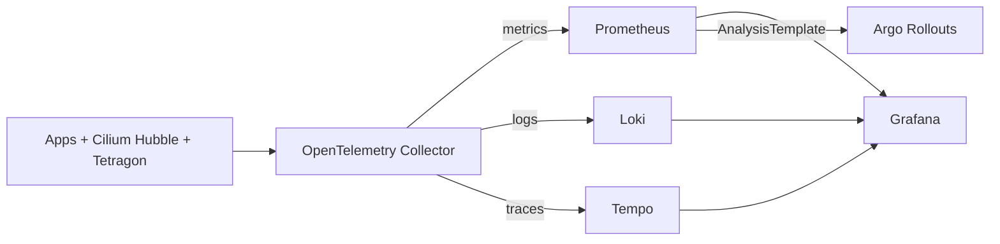

# Architecture — Northstar Payments on EKS

This is the deep-dive for [`scenarios/fintech-payments`](README.md). Facts reflect the Kubernetes and AWS ecosystems as of September 2026. Sibling ADRs record *why*; this document records *what is running and how it fails*.

## Control plane

Amazon EKS runs the Kubernetes control plane as a multi-AZ service. We do not operate etcd, kube-apiserver, or kube-scheduler ourselves. We do configure:

| Knob | Value | Why |
| --- | --- | --- |
| Kubernetes | **1.34** | In [EKS standard support](https://docs.aws.amazon.com/eks/latest/userguide/kubernetes-versions.html) through 2026-12-02. Karpenter 1.14.1 supports 1.29–1.36; 1.35/1.36 are available but a regulated platform stays on N-1 until Cilium, CSI, and Gatekeeper list them. |
| Endpoint | Private always on; public optional and CIDR-locked | PCI-flavored clusters should be private ([AKS PCI guidance](https://learn.microsoft.com/en-us/azure/aks/pci-summary) is the same idea on another cloud). Public is a lab convenience. |
| Logs | `api`, `audit`, `authenticator`, `controllerManager`, `scheduler` | PCI-DSS 4.0.1 Req. 10. Audit logs go to CloudWatch, then to Loki via a subscription (or stay in CloudWatch + S3 export). |
| Secrets encryption | KMS CMK, `resources = ["secrets"]` | etcd encryption at rest. This is *not* a substitute for Vault; it is defense in depth for the Secrets that unavoidably exist (TLS, bootstrap). |
| Auth | IRSA + EKS Pod Identity | Karpenter uses Pod Identity ([module default](https://registry.terraform.io/modules/terraform-aws-modules/eks/aws/20.37.1)); Velero and Vault use IRSA. |
| Add-ons | vpc-cni, kube-proxy, coredns, eks-pod-identity-agent | vpc-cni `before_compute = true` so the managed node group becomes Ready in one apply. |

We considered [EKS Auto Mode](https://docs.aws.amazon.com/eks/latest/best-practices/automode.html). Auto Mode is AWS-managed Karpenter + Bottlerocket and is the right default for *new unregulated* clusters. We keep self-managed Karpenter because the CDE NodePool needs a taint, an on-demand-only capacity type, and an AMI pin that we can explain to a QSA. Auto Mode hides those knobs. See [ADR 0002](decisions/0002-karpenter-over-cluster-autoscaler.md).

Cluster API is the right language if we ever grow a fleet of *many* clusters (one per tenant, or one per region as a CRD). For a single primary + one DR cluster, the AWS API + Terraform is less moving surface. Revisit when the third region appears.

## Data plane

```mermaid
flowchart LR
  subgraph mng ["Managed node group — system"]
    K[Karpenter controller ×2]
    C[Cilium agent DS]
    O[Cilium operator ×2]
    D[CoreDNS]
  end
  subgraph cdePool ["NodePool cde"]
    N1[on-demand m/c/r gen>2]
    Taint["taint pci.northstar.example/cde=true:NoSchedule"]
  end
  subgraph platPool ["NodePool platform"]
    N2[on-demand]
    N3[Spot]
  end
  Pending[unschedulable Pod] --> K
  K -->|EC2 Fleet| N1
  K -->|EC2 Fleet| N2
  K -->|EC2 Fleet| N3
```

Three compute identities:

1. **System MNG** — three AZs, on-demand `m6i.large`/`m5.large`, label `karpenter.sh/controller=true`. Runs Karpenter, Cilium, CoreDNS, metrics-server. Minimum 3 so a single AZ outage does not strand the autoscaler. Disk is gp3, encrypted.
2. **NodePool `cde`** — on-demand only, taint `pci.northstar.example/cde=true:NoSchedule`, consolidation `WhenEmpty` (not underutilized) so a payments replica is not packed onto a node that Karpenter then deletes. See [ADR 0012](decisions/0012-cde-on-demand-nodes.md).
3. **NodePool `platform`** — on-demand + Spot, consolidation `WhenEmptyOrUnderutilized`. Argo CD, Prometheus, Loki, Vault *standby* can live here; Vault *active* and anything that unseals CDE keys stays on `cde`.

Karpenter CRDs are the **v1** names (`NodePool`, `EC2NodeClass`). `Provisioner` / `AWSNodeTemplate` were removed in Karpenter 1.0 ([migration](https://karpenter.sh/docs/upgrading/v1-migration/)). Interruption handling uses the SQS queue the terraform-aws-eks Karpenter submodule creates; Spot two-minute warnings drain CDE-adjacent *platform* nodes. CDE nodes never choose Spot.

Topology spread on every CDE Deployment:

```yaml
topologySpreadConstraints:
  - maxSkew: 1
    topologyKey: topology.kubernetes.io/zone
    whenUnsatisfiable: DoNotSchedule
    labelSelector:
      matchLabels:
        app.kubernetes.io/name: payments-api
```

`spec.trafficDistribution: PreferSameZone` on in-cluster Services (GA since 1.33, renamed from `PreferClose` in 1.34 — [KEP-3015](https://github.com/kubernetes/enhancements/issues/3015)) keeps east-west RPC inside an AZ when a local endpoint exists.

PodDisruptionBudgets: `minAvailable: 2` on payments-api / gateway / ledger. Karpenter honors PDBs during consolidation and interruption ([disruption docs](https://karpenter.sh/docs/concepts/disruption/)).

## Networking topology

Cilium is chained onto the Amazon VPC CNI so Pods still get ENI IPs (security-group-per-pod remains available) while Cilium attaches eBPF programs for NetworkPolicy, Hubble, and kube-proxy-replacement *later*. Full ENI-mode Cilium (`eni.enabled=true`, vpc-cni removed) is a second-pass migration; it is not required to get PCI-grade microsegmentation. See [ADR 0003](decisions/0003-cilium-cni-networkpolicy.md) and [Cilium EKS Helm install](https://docs.cilium.io/en/stable/installation/k8s-install-helm/).

```mermaid
flowchart TB
  subgraph public ["Public subnets /24 × 3 AZs"]
    IGW[Internet Gateway]
    NAT1[NAT AZ-a]
    NAT2[NAT AZ-b]
    NAT3[NAT AZ-c]
    NLB[internet-facing NLB<br/>kubernetes.io/role/elb=1]
  end
  subgraph intra ["Intra subnets /24 — control-plane ENIs"]
    CPENI[EKS API ENIs]
  end
  subgraph private ["Private subnets /20 × 3 AZs"]
    Nodes[System MNG + Karpenter nodes]
    ILB[internal NLB<br/>kubernetes.io/role/internal-elb=1]
    subgraph eBPF [Cilium eBPF]
      NP[NetworkPolicy + CiliumNetworkPolicy]
      Hub[Hubble]
    end
  end
  Merch[Merchant TLS] --> NLB --> GWPod[gateway Pod]
  GWPod --> NP --> APIPod[api Pod]
  Nodes --> NAT1
  Nodes --> NAT2
  Nodes --> NAT3
  NAT1 --> IGW
  CPENI -.-> Nodes
```

Subnet math inside `10.64.0.0/16` (distinct from the lab `10.42.0.0/16` in `clusters/eks`):

| Kind | Prefix | Count | Role |
| --- | --- | --- | --- |
| Private | /20 | 3 | Nodes, Karpenter, internal LBs. Tagged `karpenter.sh/discovery` and `kubernetes.io/role/internal-elb=1`. |
| Public | /24 | 3 | NAT, internet-facing NLB. Tagged `kubernetes.io/role/elb=1`. |
| Intra | /24 | 3 | EKS control-plane ENIs. No Pod IPs. |

One NAT **per AZ**. A single NAT is a lab cost optimization and an AZ-failure black hole for egress (image pulls, Vault auto-unseal to KMS, Velero to S3). Production `single_nat_gateway = false`.

### Microsegmentation (the CDE)

Default-deny `NetworkPolicy` in every CDE namespace. Allowed edges:



`fraud` and `webhooks` cannot initiate connections *into* the CDE. They are out of PCI scope *only if* that statement stays true and is pentested (Req. 11.4.5). Hubble flow logs are the evidence.

North-south: [Gateway API v1.6.1](https://kubernetes.io/blog/2026/08/03/gateway-api-v1-6-release/) `Gateway` + `HTTPRoute`. Listeners are HTTPS only; HTTP is not bound. Gatekeeper constraint `K8sHttpsOnly` covers leftover Ingress objects; `K8sGatewayHttpsOnly` covers Gateway listeners. ingress-nginx is not installed.

We do **not** run a sidecar mesh on the CDE. Cilium NetworkPolicy (L3/L4, L7 HTTP where needed) plus Vault mTLS for secrets is enough. Istio ambient is GA ([since 1.24](https://istio.io/latest/docs/ambient/overview/)) and is the right next step if we need L7 identity between *every* pair. Adding ztunnel now expands PCI scope to the mesh datapath without a compensating control. See [docs/architecture/networking.md](../../docs/architecture/networking.md).

## Workloads

| Service | Namespace | Scope | Notes |
| --- | --- | --- | --- |
| payments-gateway | `cde-gateway` | CDE | Terminates TLS, tokenizes PAN, talks to the network connector. Canary via Argo Rollouts. |
| payments-api | `cde-api` | CDE | Authorization / capture / refund state machine. Never logs PAN. |
| payments-ledger | `cde-ledger` | CDE | Double-entry; durable state on CSI volumes (EBS gp3, encrypted, snapshots). |
| fraud-engine | `fraud` | Out of CDE | Scores tokens + device + amount. No path to PAN. |
| webhook-dispatcher | `webhooks` | Out of CDE | Merchant HTTP callbacks over TLS. |

Sample manifests live under [`gitops/charts/`](gitops/) and use `public.ecr.aws/nginx/nginx:1.27` as a stand-in image so the charts lint and render without a private registry. Replace the image with the internal build in Argo CD Helm values; do not put a dummy password in Git.

## Secrets, policy, runtime

Admission pipeline, in order:

1. **Pod Security Admission** `restricted` on every application namespace ([PSA](https://kubernetes.io/docs/concepts/security/pod-security-admission/)).
2. **ValidatingAdmissionPolicy** (CEL, GA since 1.30) for cheap rules (“no LoadBalancer in CDE”).
3. **Gatekeeper** for Rego the org already writes: require requests/limits, require non-root, deny privileged, HTTPS-only Ingress/Gateway. Policies are in [`policies/`](policies/).
4. **Tetragon** 1.7.1 ([release](https://github.com/cilium/tetragon/releases/tag/v1.7.1)) — eBPF `TracingPolicy` that `Sigkill`s `/bin/bash` in CDE pods and records `connect` to non-allowlisted CIDRs. In-kernel, no TOCTOU.

Secrets:

- HashiCorp Vault **2.0.4** (Helm chart **0.34.1**, tested on Kubernetes 1.32–1.36 per [Vault Helm docs](https://developer.hashicorp.com/vault/docs/deploy/kubernetes/helm)). HA Raft, 3 replicas, auto-unseal with the Terraform-created KMS key, Pod anti-affinity across AZs.
- [Secrets Store CSI](https://secrets-store-csi-driver.sigs.k8s.io/concepts) + [Vault CSI provider](https://developer.hashicorp.com/vault/docs/deploy/kubernetes/csi) (`SecretProviderClass` `secrets-store.csi.x-k8s.io/v1`). The Pod’s ServiceAccount is the Vault identity.
- Kubernetes Secrets are allowed only for TLS material the Gateway controller must read, and they are encrypted at rest with KMS.

We do not use External Secrets Operator as the source of truth for CDE material: it copies into etcd. See [ADR 0006](decisions/0006-vault-for-secrets.md).

## Delivery

Argo CD **3.5.2** ([release](https://github.com/argoproj/argo-cd/releases/tag/v3.5.2)), Helm chart **10.6.4**, HA install. App-of-apps: one root `Application` (applied once from [`gitops/charts/bootstrap`](gitops/charts/bootstrap)) creates one child `Application` per service. AppProject `cde` may destinate only `cde-*` namespaces; AppProject `platform` destines the rest.

Argo Rollouts **1.9.1** ([release](https://github.com/argoproj/argo-rollouts/releases/tag/v1.9.1)) replaces Deployment on `payments-api` and `payments-gateway`. Canary weights 10 → 50 → 100 with Prometheus `AnalysisTemplate` on 5xx ratio. A failed analysis aborts. See [ADR 0005](decisions/0005-argo-rollouts-progressive-delivery.md).

## Observability

One pipeline, four backends:



- **OpenTelemetry Collector** (operator from [opentelemetry-helm-charts](https://github.com/open-telemetry/opentelemetry-helm-charts)): OTLP 4317/4318, Kubernetes attributes processor, redaction processor on known PAN field names.
- **kube-prometheus-stack 88.6.1** ([prometheus-community](https://github.com/prometheus-community/helm-charts)): Prometheus, Grafana, Alertmanager, node-exporter, kube-state-metrics.
- **Loki** (community chart, forked 16 March 2026 to [grafana-community/helm-charts](https://github.com/grafana-community/helm-charts)): object storage on the Velero-adjacent S3 prefix, retention 90 days for CDE logs (PCI Req. 10.5.1 is one year for *audit* logs — CloudWatch/S3 holds the Kubernetes audit log for 365 days; Loki is operational).
- **Tempo**: OTLP ingest, S3 backend.

PCI Req. 10 wants *audit* logs that cannot be altered by the workload. Kubernetes API audit → CloudWatch (AWS-managed) is that trail. Application logs in Loki are operational, not the ROC evidence.

## HA and DR

| Failure | Detection | Automatic? | RTO | RPO | Mechanism |
| --- | --- | --- | --- | --- | --- |
| One Pod | kubelet + PDB | Yes | seconds | 0 | ReplicaSet / Rollout |
| One node | node lease, Karpenter interruption | Yes | 1–3 min | 0 | Karpenter launches a replacement; PDB keeps serving |
| One AZ | subnet empty, endpoints elsewhere | Yes | ≤ 5 min | 0 | 3 AZ spread, NAT per AZ, EKS HA, Aurora-style disk is AZ-replicated EBS snapshots + 3 replicas |
| EKS control plane (AZ) | AWS | Yes (AWS) | minutes | 0 | EKS multi-AZ API |
| Cluster (config + volumes) | Velero backup fail / human | Human | 2 h in-region | 1 h | Velero CSI snapshots + object backup, hourly |
| Region | health check + human | Human | 4 h | 15 min | Warm EKS in us-east-1, S3 replica, restore runbook |

Velero (`velero.io/v1` `Backup`, `BackupStorageLocation`, `Schedule`) writes to the Terraform-created bucket. CSI snapshots for EBS (install the EKS `snapshot-controller` add-on). File-system backup is **not** used for CDE volumes; it is not crash-consistent. See [ADR 0008](decisions/0008-velero-backup-dr.md) and the [DR runbook](runbooks/disaster-recovery.md).

Velero restores into a cluster that already exists. Order: Terraform apply in DR region → wait for system nodes + Cilium + Karpenter → Velero restore (exclude `kube-system`, `karpenter` NodePools that Terraform already owns) → Vault unseal from Raft snapshot → DNS/Gateway cutover.

We do **not** run Cilium Cluster Mesh active-active across regions for the authorization path. Dual-region writes to a ledger without a single source of truth is a consistency incident, not an RTO win. Cluster Mesh is the right tool for *read* failover of cached token metadata, not for capture.

## How PCI-DSS 4.0.1 maps onto this design

PCI-DSS 4.0.1 is the only active standard ([3.2.1 retired 31 March 2024](https://www.pcisecuritystandards.org/); future-dated 4.0 controls became mandatory 31 March 2025). Segmentation is **not** required, but it is the only practical way to keep the CDE smaller than “the whole AWS account.” When you claim segmentation, Req. 1.2.6 (justified allowed flows), 1.3 (restrict CDE traffic), 1.2.7 (six-month ruleset review), and 11.4.5 (pentest the boundary) apply.

| PCI concern | In this design | In scope? |
| --- | --- | --- |
| Store / process / transmit CHD | `cde-gateway` (PAN in memory for milliseconds), tokenization vault in Vault | Yes — CDE |
| Systems that can affect CDE security | EKS API, Cilium, Gatekeeper, Vault, Argo CD, Tetragon, Velero, the `cde` NodePool, the VPC | Yes — connected-to |
| Token-only services with no CDE path | `fraud`, `webhooks` | No, *if* pentest confirms |
| Kubernetes audit log | CloudWatch `audit` | Yes — logging channel |
| Merchant laptops | Out of this repo | Separate |

What we deliberately do **not** put in the CDE:

- PAN on disk. Tokenize at the gateway; Vault holds the token↔PAN map under a policy that only `cde-gateway` can decrypt.
- PAN in logs, traces, or metrics. OTel redaction + application contract + Tetragon.
- Shared nodes with out-of-scope workloads. CDE taint.
- Spot for CDE. Availability + noisy-neighbor argument for a QSA.

The full control-by-control table is [cost-and-compliance.md](cost-and-compliance.md). This is guidance, not a ROC.

## When to use / when NOT to use this architecture

**Use it** when you are processing payments (or similarly regulated traffic) on AWS, you can afford three NAT Gateways, and you have a platform team that can operate Vault and Argo CD.

**Do not use it** for a single microservice with no CHD, for a laptop demo, or as a reason to skip a QSA. Do not copy the CDE taint onto a cluster that also runs untrusted CI jobs — that is a scope explosion.

### Trade-offs

| We chose | Instead of | Cost of the choice |
| --- | --- | --- |
| One cluster, namespace + node taint segmentation | Cluster-per-CDE | Smaller bill, larger blast radius if NetworkPolicy regresses. Pentest must be real. |
| Chained Cilium | Cilium exclusive ENI | Faster day-1; kube-proxy still exists until the migration. |
| Vault in-cluster | AWS Secrets Manager + ASM CSI | Portable, richer policy; you run Raft. |
| Self-managed Karpenter | EKS Auto Mode | More YAML, more control. |
| Warm standby region | Active-active Cluster Mesh | Simpler consistency; 4 h RTO. |

### Gotchas

- **Scope creep via observability.** A debug `console.log(req.body)` puts Loki, Tempo, and Grafana in the CDE. Treat that as an incident.
- **Argo CD is connected-to.** Anyone who can sync `cde-api` can ship code that exfiltrates tokens. SSO + AppProject + commit signing (Argo CD 3.5 source integrity) are in-scope controls.
- **Velero backups contain Secrets.** The S3 bucket is encrypted, replicated, and in the CDE logging/backup account. Bucket policy denies public and cross-account except the replica role.
- **IMDSv2 hop limit 2** on EC2NodeClass. Hop limit 1 breaks IRSA inside Pods ([Karpenter NodeClass](https://karpenter.sh/docs/concepts/nodeclasses/)).
